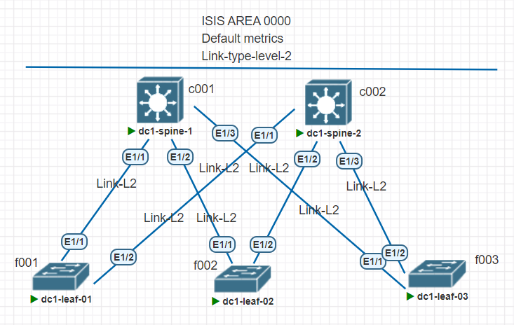

## Underlay. ISIS

#### Цель:
Настроить IS-IS для Underlay сети

**Описание/Пошаговая инструкция выполнения домашнего задания:**   
* настроить IS-IS в Underlay сети, для IP связанности между всеми устройствами NXOS
* План работы, адресное пространство, схема сети, настройки - зафиксированы в документации
* План работы, 
  * Выполнить настройки следуя рекомендациям; 
  * Выгрузить настройки в документацию.

**Общие характеристики сети**  
* **Топология** - Сеть Клоса
* **Уровней коммутации** - 2 (Spine,Leaf)
* **Протокол** - IS-IS
* **Тип связей IS-IS** - L2
* **Тип IS-IS сети** - PtP
* **Area** - Общая для всех устройств (backbone)
* **Образ** - NxOS 9.3

**Параметры IS-IS** (bold means not default)
* Administrative distance -	115
* Area level -	*Level-2*
* DIS priority - 64
* Graceful restart - Enabled
* Hello multiplier - 3
* Hello padding - Enabled
* Hello time - 10 seconds
* IS-IS feature - *Enabled*
* LSP interval - 33
* LSP MTU - 1492
* Maximum LSP lifetime - 1200 seconds
* Maximum paths - 8
* Metric - 40
* Reference bandwidth - 40 Gbps

#### План настройки: 

Шаг-1 - Включить IS-IS feature на устройстве;
Шаг-2 - Создать IS-IS инстанс; 
Шаг-3 - Добавить интерфейсы в IS-IS инстанс;
Шаг-4 - Проверить связность сетей.

Общие настройки:

net example 47.0000.0000.0001.c001.00
содержит следующие поля:

AFI - 47
Area ID - 0000
System ID - 0000.0001.[xxxx]
Selector - 00

Для процесса:

feature isis

router isis otus
  net 47.0000.0000.0001.f003.00
  is-type level-2

interface VlanXX\  
ip router isis otus

interface loopback1\
  ip router isis otus

interface loopback2\
  ip router isis otus

interface Ethernet1/1\
  ip router isis otus

interface Ethernet1/2\
  ip router isis otus

**Перечень NET для маршрутизаторов**

|Dev-Name   |AFI   |Area ID     |System ID     |Selector   |#Комментарий        |
|:---------:|:---:|:-----------:|:------------:|:---------:|--------------------|
|dc1-spine-1| 47  |    0000     |0000.0001.c001|   00      | #net-Spine1        |
|dc1-spine-2| 47  |    0000     |0000.0001.c002|   00      | #net-Spine2        |
|dc1-leaf-01| 47  |    0000     |0000.0001.f001|   00      | #net-Leaf1         |
|dc1-leaf-02| 47  |    0000     |0000.0001.f002|   00      | #net-Leaf2         |
|dc1-leaf-03| 47  |    0000     |0000.0001.f003|   00      | #net-Leaf3         |

**Адресный план:**

#### Адресация Loopback интерфейсов

|Dev-Name   |Pn   |Dn           |Sn    |Xn    |Mask|#Комментарий              |
|:---------:|:---:|:-----------:|:----:|:----:|:--:|--------------------------|
|dc1-spine-1| 10  |    0        |  1   |   0  | /32| #Loopback1-Spine1        |
|dc1-spine-2| 10  |    0        |  2   |   0  | /32| #Loopback1-Spine2        |
|dc1-spine-1| 10  |    1        |  1   |   0  | /32| #Loopback2-Spine1        |
|dc1-spine-2| 10  |    1        |  2   |   0  | /32| #Loopback2-Spine2        |
|dc1-leaf-01| 10  |    0        |  1   |   1  | /32| #Loopback1-Leaf1         |
|dc1-leaf-02| 10  |    0        |  1   |   2  | /32| #Loopback1-Leaf2         |
|dc1-leaf-03| 10  |    0        |  1   |   3  | /32| #Loopback1-Leaf3         |
|dc1-leaf-01| 10  |    1        |  2   |   1  | /32| #Loopback2-Leaf1         |
|dc1-leaf-02| 10  |    1        |  2   |   2  | /32| #Loopback2-Leaf2         |
|dc1-leaf-03| 10  |    1        |  2   |   3  | /32| #Loopback2-Leaf3         |

#### Адресация интерфейсов PtP соединений

|Dev-Name   |Pn   |Dn           |Sn    |Xn    |Mask|#Комментарий              |
|:---------:|:---:|:-----------:|:----:|:----:|:--:|--------------------------|
|dc1-spine-1| 10  |    2        |  1   |   0  | /32| #p2p-link-from-dc1-leaf-01-to-dc1-spine-1|
|dc1-leaf-01| 10  |    2        |  1   |   1  | /32| #p2p-link-from-dc1-leaf-01-to-dc1-spine-1|
|dc1-spine-1| 10  |    2        |  1   |   2  | /32| #p2p-link-from-dc1-leaf-02-to-dc1-spine-1|
|dc1-leaf-02| 10  |    2        |  1   |   3  | /32| #p2p-link-from-dc1-leaf-02-to-dc1-spine-1|
|dc1-spine-1| 10  |    2        |  1   |   4  | /32| #p2p-link-from-dc1-leaf-03-to-dc1-spine-1|
|dc1-leaf-03| 10  |    2        |  1   |   5  | /32| #p2p-link-from-dc1-leaf-03-to-dc1-spine-1|
|dc1-spine-2| 10  |    2        |  2   |   0  | /32| #p2p-link-from-dc1-leaf-01-to-dc1-spine-2|
|dc1-leaf-01| 10  |    2        |  2   |   1  | /32| #p2p-link-from-dc1-leaf-01-to-dc1-spine-2|
|dc1-spine-2| 10  |    2        |  2   |   2  | /32| #p2p-link-from-dc1-leaf-02-to-dc1-spine-2|
|dc1-leaf-02| 10  |    2        |  2   |   3  | /32| #p2p-link-from-dc1-leaf-02-to-dc1-spine-2|
|dc1-spine-2| 10  |    2        |  2   |   4  | /32| #p2p-link-from-dc1-leaf-03-to-dc1-spine-2|
|dc1-leaf-03| 10  |    2        |  2   |   5  | /32| #p2p-link-from-dc1-leaf-03-to-dc1-spine-2|

#### Проверка работы протокола:

dc1-leaf-03# show ip ro\
IP Route Table for VRF "default"\
'*' denotes best ucast next-hop\
'**' denotes best mcast next-hop\
'[x/y]' denotes [preference/metric]\
'%<string>' in via output denotes VRF <string>\

10.0.1.1/32, ubest/mbest: 1/0\
    *via 10.2.2.4, Eth1/2, [115/81], 00:00:10, isis-otus, L2\
10.0.1.2/32, ubest/mbest: 1/0\
    *via 10.2.2.4, Eth1/2, [115/81], 00:00:10, isis-otus, L2\
10.0.1.3/32, ubest/mbest: 2/0, attached\
    *via 10.0.1.3, Lo1, [0/0], 00:37:50, local\
    *via 10.0.1.3, Lo1, [0/0], 00:37:50, direct\
10.0.2.0/32, ubest/mbest: 1/0\
    *via 10.2.2.4, Eth1/2, [115/41], 00:00:11, isis-otus, L2\
10.1.2.0/32, ubest/mbest: 1/0\
    *via 10.2.2.4, Eth1/2, [115/41], 00:00:11, isis-otus, L2\
10.1.2.1/32, ubest/mbest: 1/0\
    *via 10.2.2.4, Eth1/2, [115/81], 00:00:10, isis-otus, L2\
10.1.2.2/32, ubest/mbest: 1/0\
    *via 10.2.2.4, Eth1/2, [115/81], 00:00:10, isis-otus, L2\
10.1.2.3/32, ubest/mbest: 2/0, attached\
    *via 10.1.2.3, Lo2, [0/0], 00:37:50, local\
    *via 10.1.2.3, Lo2, [0/0], 00:37:50, direct\
10.2.1.0/31, ubest/mbest: 1/0\
    *via 10.2.2.4, Eth1/2, [115/120], 00:00:10, isis-otus, L2\
10.2.1.2/31, ubest/mbest: 1/0\
    *via 10.2.2.4, Eth1/2, [115/120], 00:00:10, isis-otus, L2\
10.2.1.4/31, ubest/mbest: 1/0, attached\
    *via 10.2.1.5, Eth1/1, [0/0], 00:37:53, direct\
10.2.1.5/32, ubest/mbest: 1/0, attached\
    *via 10.2.1.5, Eth1/1, [0/0], 00:37:53, local\
10.2.2.0/31, ubest/mbest: 1/0\
    *via 10.2.2.4, Eth1/2, [115/80], 00:00:11, isis-otus, L2\
10.2.2.2/31, ubest/mbest: 1/0\
    *via 10.2.2.4, Eth1/2, [115/80], 00:00:11, isis-otus, L2\
10.2.2.4/31, ubest/mbest: 1/0, attached\
    *via 10.2.2.5, Eth1/2, [0/0], 00:37:51, direct\
10.2.2.5/32, ubest/mbest: 1/0, attached\
    *via 10.2.2.5, Eth1/2, [0/0], 00:37:51, local\
10.4.1.0/24, ubest/mbest: 1/0\
    *via 10.2.2.4, Eth1/2, [115/120], 00:00:10, isis-otus, L2\
10.4.2.0/24, ubest/mbest: 1/0\
    *via 10.2.2.4, Eth1/2, [115/120], 00:00:10, isis-otus, L2\
10.4.3.0/24, ubest/mbest: 1/0, attached\
    *via 10.4.3.1, Vlan43, [0/0], 00:37:50, direct\
10.4.3.1/32, ubest/mbest: 1/0, attached\
    *via 10.4.3.1, Vlan43, [0/0], 00:37:50, local\
