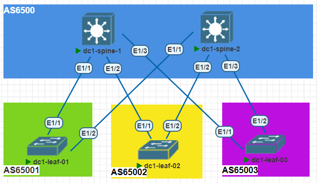

## Underlay. BGP

#### Цель:
Настроить BGP для Underlay сети


**Описание/Пошаговая инструкция выполнения домашнего задания:**   
* настроить BGP в Underlay сети, для IP связанности между всеми устройствами NXOS
* План работы, адресное пространство, схема сети, настройки - зафиксированы в документации
* План работы, 
  * Выполнить настройки следуя рекомендациям; 
  * Выгрузить настройки в документацию.

**Общие характеристики сети**  
* **Топология** - Сеть Клоса
* **Уровней коммутации** - 2 (Spine,Leaf)
* **Протокол** - BGP
* **Тип BGP сети** - eBGP
* **Spine AS** - одна;
* **Leaf AS** - уникальные;
* **Образ** - NxOS 9.3

**Параметры BGP** (bold means not default)
* BGP feature - *Enabled*
* Reconnect-interval *12*
* Keep alive interval - *3 seconds*
* Hold timer - *9 seconds*
* BGP PIC core - enabled
* Auto-summary - Always disabled
* Synchronization - Always disabled
* Dynamic capability - enabled
* BGP additional paths - *Enabled*
* ECMP - maximum path - 64
* bestpath - multipath-relax 


#### План настройки: 

Шаг-1 - Настройка route-map для редистрибьюции;
Шаг-2 - Включить BGP feature на устройстве;
Шаг-3 - Создать BGP инстанс (AS); 
Шаг-4 - Настройка BGP опций 
Шаг-5 - Настройка шаблонов конфигурации соседств (leaf-side);
Шаг-6 - Объявление соседей;
Шаг-7 - Проверить связность сетей.


**Перечень ASN для маршрутизаторов**

|Dev-Name   |AS    |RID       |#Комментарий        |
|:---------:|:----:|:--------:|--------------------|
|dc1-spine-1| 65000| 10.0.1.0 | #Lo1-Spine1        |
|dc1-spine-2| 65000| 10.0.2.0 | #Lo1-Spine2        |
|dc1-leaf-01| 65001| 10.0.1.1 | #Lo1-Leaf1         |
|dc1-leaf-02| 65002| 10.0.1.2 | #Lo1-Leaf2         |
|dc1-leaf-03| 65003| 10.0.1.3 | #Lo1-Leaf3         |



**Адресный план:**

#### Адресация Loopback интерфейсов

|Dev-Name   |Pn   |Dn           |Sn    |Xn    |Mask|#Комментарий              |
|:---------:|:---:|:-----------:|:----:|:----:|:--:|--------------------------|
|dc1-spine-1| 10  |    0        |  1   |   0  | /32| #Loopback1-Spine1        |
|dc1-spine-2| 10  |    0        |  2   |   0  | /32| #Loopback1-Spine2        |
|dc1-spine-1| 10  |    1        |  1   |   0  | /32| #Loopback2-Spine1        |
|dc1-spine-2| 10  |    1        |  2   |   0  | /32| #Loopback2-Spine2        |
|dc1-leaf-01| 10  |    0        |  1   |   1  | /32| #Loopback1-Leaf1         |
|dc1-leaf-02| 10  |    0        |  1   |   2  | /32| #Loopback1-Leaf2         |
|dc1-leaf-03| 10  |    0        |  1   |   3  | /32| #Loopback1-Leaf3         |
|dc1-leaf-01| 10  |    1        |  2   |   1  | /32| #Loopback2-Leaf1         |
|dc1-leaf-02| 10  |    1        |  2   |   2  | /32| #Loopback2-Leaf2         |
|dc1-leaf-03| 10  |    1        |  2   |   3  | /32| #Loopback2-Leaf3         |

#### Адресация интерфейсов PtP соединений

|Dev-Name   |Pn   |Dn           |Sn    |Xn    |Mask|#Комментарий              |
|:---------:|:---:|:-----------:|:----:|:----:|:--:|--------------------------|
|dc1-spine-1| 10  |    2        |  1   |   0  | /32| #p2p-link-from-dc1-leaf-01-to-dc1-spine-1|
|dc1-leaf-01| 10  |    2        |  1   |   1  | /32| #p2p-link-from-dc1-leaf-01-to-dc1-spine-1|
|dc1-spine-1| 10  |    2        |  1   |   2  | /32| #p2p-link-from-dc1-leaf-02-to-dc1-spine-1|
|dc1-leaf-02| 10  |    2        |  1   |   3  | /32| #p2p-link-from-dc1-leaf-02-to-dc1-spine-1|
|dc1-spine-1| 10  |    2        |  1   |   4  | /32| #p2p-link-from-dc1-leaf-03-to-dc1-spine-1|
|dc1-leaf-03| 10  |    2        |  1   |   5  | /32| #p2p-link-from-dc1-leaf-03-to-dc1-spine-1|
|dc1-spine-2| 10  |    2        |  2   |   0  | /32| #p2p-link-from-dc1-leaf-01-to-dc1-spine-2|
|dc1-leaf-01| 10  |    2        |  2   |   1  | /32| #p2p-link-from-dc1-leaf-01-to-dc1-spine-2|
|dc1-spine-2| 10  |    2        |  2   |   2  | /32| #p2p-link-from-dc1-leaf-02-to-dc1-spine-2|
|dc1-leaf-02| 10  |    2        |  2   |   3  | /32| #p2p-link-from-dc1-leaf-02-to-dc1-spine-2|
|dc1-spine-2| 10  |    2        |  2   |   4  | /32| #p2p-link-from-dc1-leaf-03-to-dc1-spine-2|
|dc1-leaf-03| 10  |    2        |  2   |   5  | /32| #p2p-link-from-dc1-leaf-03-to-dc1-spine-2|

#### Проверка работы протокола:
```
dc1-leaf-03# sh running-config section bgp
show running-config | section bgp
feature bgp
router bgp 65003
  router-id 10.0.1.3
  bestpath as-path multipath-relax
  reconnect-interval 12
  address-family ipv4 unicast
    redistribute direct route-map rd-conn
    maximum-paths 64
  template peer spine
    remote-as 65000
    timers 3 9
    address-family ipv4 unicast
  neighbor 10.2.1.4
    inherit peer spine
  neighbor 10.2.2.4
    inherit peer spine
dc1-leaf-03# show route-map rd-conn 
route-map rd-conn, permit, sequence 10 
  Match clauses:
    interface: loopback0 loopback1 
  Set clauses:
```

Проверка маршрутной информации
```
dc1-leaf-03# show ip route 
IP Route Table for VRF "default"
'*' denotes best ucast next-hop
'**' denotes best mcast next-hop
'[x/y]' denotes [preference/metric]
'%<string>' in via output denotes VRF <string>

10.0.1.0/32, ubest/mbest: 1/0
    *via 10.2.1.4, [20/0], 01:10:11, bgp-65003, external, tag 65000
10.0.1.1/32, ubest/mbest: 2/0
    *via 10.2.1.4, [20/0], 05:00:02, bgp-65003, external, tag 65000
    *via 10.2.2.4, [20/0], 03:27:40, bgp-65003, external, tag 65000
10.0.1.2/32, ubest/mbest: 2/0
    *via 10.2.1.4, [20/0], 04:59:53, bgp-65003, external, tag 65000
    *via 10.2.2.4, [20/0], 03:27:40, bgp-65003, external, tag 65000
10.0.1.3/32, ubest/mbest: 2/0, attached
    *via 10.0.1.3, Lo1, [0/0], 05:57:18, local
    *via 10.0.1.3, Lo1, [0/0], 05:57:18, direct
10.0.2.0/32, ubest/mbest: 1/0
    *via 10.2.2.4, [20/0], 01:09:35, bgp-65003, external, tag 65000
10.1.1.0/32, ubest/mbest: 1/0
    *via 10.2.1.4, [20/0], 01:10:11, bgp-65003, external, tag 65000
10.1.2.3/32, ubest/mbest: 2/0, attached
    *via 10.1.2.3, Lo2, [0/0], 05:57:17, local
    *via 10.1.2.3, Lo2, [0/0], 05:57:17, direct
10.2.1.4/31, ubest/mbest: 1/0, attached
    *via 10.2.1.5, Eth1/1, [0/0], 05:57:19, direct
10.2.1.5/32, ubest/mbest: 1/0, attached
    *via 10.2.1.5, Eth1/1, [0/0], 05:57:19, local
10.2.2.4/31, ubest/mbest: 1/0, attached
    *via 10.2.2.5, Eth1/2, [0/0], 05:57:18, direct
10.2.2.5/32, ubest/mbest: 1/0, attached
    *via 10.2.2.5, Eth1/2, [0/0], 05:57:18, local
10.4.3.0/24, ubest/mbest: 1/0, attached
    *via 10.4.3.1, Vlan43, [0/0], 05:57:17, direct
10.4.3.1/32, ubest/mbest: 1/0, attached
    *via 10.4.3.1, Vlan43, [0/0], 05:57:17, local
```
###Проверка связности
```
dc1-leaf-03# ping 10.0.1.1 source-interface loopback 1
PING 10.0.1.1 (10.0.1.1): 56 data bytes
64 bytes from 10.0.1.1: icmp_seq=0 ttl=253 time=12.458 ms
64 bytes from 10.0.1.1: icmp_seq=1 ttl=253 time=15.466 ms
64 bytes from 10.0.1.1: icmp_seq=2 ttl=253 time=10.021 ms
64 bytes from 10.0.1.1: icmp_seq=3 ttl=253 time=12.3 ms
64 bytes from 10.0.1.1: icmp_seq=4 ttl=253 time=8.888 ms

--- 10.0.1.1 ping statistics ---
5 packets transmitted, 5 packets received, 0.00% packet loss
round-trip min/avg/max = 8.888/11.826/15.466 ms
dc1-leaf-03# ping 10.0.1.2 source-interface loopback 1
PING 10.0.1.2 (10.0.1.2): 56 data bytes
64 bytes from 10.0.1.2: icmp_seq=0 ttl=253 time=16.049 ms
64 bytes from 10.0.1.2: icmp_seq=1 ttl=253 time=15.134 ms
64 bytes from 10.0.1.2: icmp_seq=2 ttl=253 time=29.772 ms
64 bytes from 10.0.1.2: icmp_seq=3 ttl=253 time=23.432 ms
64 bytes from 10.0.1.2: icmp_seq=4 ttl=253 time=44.779 ms

--- 10.0.1.2 ping statistics ---
5 packets transmitted, 5 packets received, 0.00% packet loss
round-trip min/avg/max = 15.134/25.833/44.779 ms
dc1-leaf-03# ping 10.0.1.3 source-interface loopback 1
PING 10.0.1.3 (10.0.1.3): 56 data bytes
64 bytes from 10.0.1.3: icmp_seq=0 ttl=255 time=0.814 ms
64 bytes from 10.0.1.3: icmp_seq=1 ttl=255 time=0.452 ms
64 bytes from 10.0.1.3: icmp_seq=2 ttl=255 time=0.139 ms
64 bytes from 10.0.1.3: icmp_seq=3 ttl=255 time=0.128 ms
64 bytes from 10.0.1.3: icmp_seq=4 ttl=255 time=0.156 ms

--- 10.0.1.3 ping statistics ---
5 packets transmitted, 5 packets received, 0.00% packet loss
round-trip min/avg/max = 0.128/0.337/0.814 ms