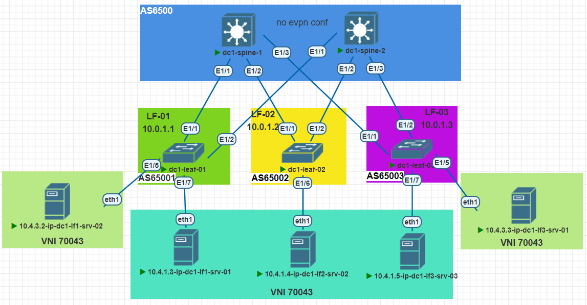

## VxLAN. EVPN-L2

#### Цель:
Настроить Overlay на основе VxLAN EVPN для L2 связанности между клиентами


**Описание/Пошаговая инструкция выполнения домашнего задания:**   
* Настроить BGP peering между Leaf и Spine в AF l2vpn evpn
* Настроена связанность между клиентами в первой зоне
* План работы, адресное пространство, схема сети, настройки - зафиксированы в документации
* План работы, 
  * Выполнить настройки следуя рекомендациям; 
  * Выгрузить настройки в документацию.

**Общие характеристики сети**  
* **Топология** - Сеть Клоса
* **Уровней коммутации** - 2 (Spine,Leaf)
* **Протокол маршрутизации** - eBGP
* **Spine AS** - одна;
* **Leaf AS** - уникальные;
* **Overlay** - BGP L2VPN;
* **VxLAN-cfg** - *только на Leaf нодах*;
* **Образ** - NxOS 9.3

**Параметры BGP** (bold means not default)
* BGP feature - *Enabled*
* Reconnect-interval *12*
* Keep alive interval - *3 seconds*
* Hold timer - *9 seconds*
* BGP PIC core - enabled
* Auto-summary - Always disabled
* Synchronization - Always disabled
* Dynamic capability - enabled
* BGP additional paths - *Enabled*
* ECMP - maximum path - 64
* bestpath - multipath-relax 

**Параметры VxLAN**
* Модель сервиса - VLAN based
* VRF - default
* update-source - loopback1
* ebgp-multihop - 3
* Тип VxLAN туннелирования - симметричный
* RD - Ручная настройка
* RT - auto
* BUM - ingress replication bgp


#### План настройки eBGP: 

+ Шаг-1 - Настройка route-map для редистрибьюции;
+ Шаг-2 - Включить BGP feature на устройстве;
+ Шаг-3 - Создать BGP инстанс (AS); 
+ Шаг-4 - Настройка BGP опций 
+ Шаг-5 - Настройка шаблонов конфигурации соседств (leaf-side);
+ Шаг-6 - Объявление соседей;
+ Шаг-7 - Проверить связность сетей.

#### План настройки vXLAN:
+ Шаг-1 - Включить evpn-feature на коммутаторах;
+ Шаг-2 - Настройка VLAN и vn-segment
+ Шаг-3 - Настройка VNI
+ Шаг-4 - Настройка RD и RT-auto
+ Шаг-5 - Настройка NVE на Lo1 и указание участников  
+ Шаг-6 - Настройка BGP на VTEP
+ Шаг-7 - Проверка работы VxLAN EVI


**Перечень ASN для маршрутизаторов**

|Dev-Name   |AS    |RID       |#Комментарий        |
|:---------:|:----:|:--------:|--------------------|
|dc1-spine-1| 65000| 10.0.1.0 | #Lo1-Spine1        |
|dc1-spine-2| 65000| 10.0.2.0 | #Lo1-Spine2        |
|dc1-leaf-01| 65001| 10.0.1.1 | #Lo1-Leaf1         |
|dc1-leaf-02| 65002| 10.0.1.2 | #Lo1-Leaf2         |
|dc1-leaf-03| 65003| 10.0.1.3 | #Lo1-Leaf3         |

**Перечень RD\VNI для маршрутизаторов**
|   VNI |Dev-Name   |AS    |RD              |#Комментарий       |
|:-----:|:---------:|:----:|:--------------:|-------------------|
| 70041 |dc1-leaf-01| 65001| 10.0.1.1:32808 | #RD-Leaf1         |
| 70041 |dc1-leaf-02| 65002| 10.0.1.2:32808 | #RD-Leaf2         |
| 70041 |dc1-leaf-03| 65003| 10.0.1.3:32808 | #RD-Leaf3         |
| 70043 |dc1-leaf-01| 65001| 10.0.1.1:65003 | #RD-Leaf1         |
| 70043 |dc1-leaf-02| 65002| 10.0.1.2:65003 | #RD-Leaf2         |
| 70043 |dc1-leaf-03| 65003| 10.0.1.3:65003 | #RD-Leaf3         |

#### Схема




**Адресный план:**

#### Адресация Loopback интерфейсов

|Dev-Name   |Pn   |Dn           |Sn    |Xn    |Mask|#Комментарий              |
|:---------:|:---:|:-----------:|:----:|:----:|:--:|--------------------------|
|dc1-spine-1| 10  |    0        |  1   |   0  | /32| #Loopback1-Spine1        |
|dc1-spine-2| 10  |    0        |  2   |   0  | /32| #Loopback1-Spine2        |
|dc1-spine-1| 10  |    1        |  1   |   0  | /32| #Loopback2-Spine1        |
|dc1-spine-2| 10  |    1        |  2   |   0  | /32| #Loopback2-Spine2        |
|dc1-leaf-01| 10  |    0        |  1   |   1  | /32| #Loopback1-Leaf1         |
|dc1-leaf-02| 10  |    0        |  1   |   2  | /32| #Loopback1-Leaf2         |
|dc1-leaf-03| 10  |    0        |  1   |   3  | /32| #Loopback1-Leaf3         |
|dc1-leaf-01| 10  |    1        |  2   |   1  | /32| #Loopback2-Leaf1         |
|dc1-leaf-02| 10  |    1        |  2   |   2  | /32| #Loopback2-Leaf2         |
|dc1-leaf-03| 10  |    1        |  2   |   3  | /32| #Loopback2-Leaf3         |

#### Адресация интерфейсов PtP соединений

|Dev-Name   |Pn   |Dn           |Sn    |Xn    |Mask|#Комментарий              |
|:---------:|:---:|:-----------:|:----:|:----:|:--:|--------------------------|
|dc1-spine-1| 10  |    2        |  1   |   0  | /32| #p2p-link-from-dc1-leaf-01-to-dc1-spine-1|
|dc1-leaf-01| 10  |    2        |  1   |   1  | /32| #p2p-link-from-dc1-leaf-01-to-dc1-spine-1|
|dc1-spine-1| 10  |    2        |  1   |   2  | /32| #p2p-link-from-dc1-leaf-02-to-dc1-spine-1|
|dc1-leaf-02| 10  |    2        |  1   |   3  | /32| #p2p-link-from-dc1-leaf-02-to-dc1-spine-1|
|dc1-spine-1| 10  |    2        |  1   |   4  | /32| #p2p-link-from-dc1-leaf-03-to-dc1-spine-1|
|dc1-leaf-03| 10  |    2        |  1   |   5  | /32| #p2p-link-from-dc1-leaf-03-to-dc1-spine-1|
|dc1-spine-2| 10  |    2        |  2   |   0  | /32| #p2p-link-from-dc1-leaf-01-to-dc1-spine-2|
|dc1-leaf-01| 10  |    2        |  2   |   1  | /32| #p2p-link-from-dc1-leaf-01-to-dc1-spine-2|
|dc1-spine-2| 10  |    2        |  2   |   2  | /32| #p2p-link-from-dc1-leaf-02-to-dc1-spine-2|
|dc1-leaf-02| 10  |    2        |  2   |   3  | /32| #p2p-link-from-dc1-leaf-02-to-dc1-spine-2|
|dc1-spine-2| 10  |    2        |  2   |   4  | /32| #p2p-link-from-dc1-leaf-03-to-dc1-spine-2|
|dc1-leaf-03| 10  |    2        |  2   |   5  | /32| #p2p-link-from-dc1-leaf-03-to-dc1-spine-2|

#### Проверка работы VxLAN:

Вывод MAC-таблицы

```
dc1-leaf-01# show mac address-table 
Legend: 
        * - primary entry, G - Gateway MAC, (R) - Routed MAC, O - Overlay MAC
        age - seconds since last seen,+ - primary entry using vPC Peer-Link,
        (T) - True, (F) - False, C - ControlPlane MAC, ~ - vsan
   VLAN     MAC Address      Type      age     Secure NTFY Ports
---------+-----------------+--------+---------+------+----+------------------
*   41     5000.0011.0001   dynamic  0         F      F    Eth1/7
C   41     5000.0012.0001   dynamic  0         F      F    nve1(10.0.1.3)
C   41     5000.0013.0001   dynamic  0         F      F    nve1(10.0.1.2)
C   41     56fe.0c99.7033   dynamic  0         F      F    nve1(10.0.1.3)
C   41     ae95.a868.ed75   dynamic  0         F      F    nve1(10.0.1.2)
C   43     5000.0014.0001   dynamic  0         F      F    nve1(10.0.1.3)
*   43     5000.0015.0001   dynamic  0         F      F    Eth1/5
C   43     76dc.baf0.7633   dynamic  0         F      F    nve1(10.0.1.3)
*   43     8a74.d0fe.1940   dynamic  0         F      F    Eth1/5
G    -     5000.0b00.1b08   static   -         F      F    sup-eth1(R)

dc1-leaf-02# show mac address-table 
Legend: 
        * - primary entry, G - Gateway MAC, (R) - Routed MAC, O - Overlay MAC
        age - seconds since last seen,+ - primary entry using vPC Peer-Link,
        (T) - True, (F) - False, C - ControlPlane MAC, ~ - vsan
   VLAN     MAC Address      Type      age     Secure NTFY Ports
---------+-----------------+--------+---------+------+----+------------------
C   41     5000.0011.0001   dynamic  0         F      F    nve1(10.0.1.1)
C   41     5000.0012.0001   dynamic  0         F      F    nve1(10.0.1.3)
*   41     5000.0013.0001   dynamic  0         F      F    Eth1/6
C   41     56fe.0c99.7033   dynamic  0         F      F    nve1(10.0.1.3)
*   41     ae95.a868.ed75   dynamic  0         F      F    Eth1/6
C   43     5000.0014.0001   dynamic  0         F      F    nve1(10.0.1.3)
C   43     5000.0015.0001   dynamic  0         F      F    nve1(10.0.1.1)
C   43     76dc.baf0.7633   dynamic  0         F      F    nve1(10.0.1.3)
C   43     8a74.d0fe.1940   dynamic  0         F      F    nve1(10.0.1.1)
G    -     5000.0e00.1b08   static   -         F      F    sup-eth1(R)
G   42     5000.0e00.1b08   static   -         F      F    sup-eth1(R)

dc1-leaf-03# show mac address-table 
Legend: 
        * - primary entry, G - Gateway MAC, (R) - Routed MAC, O - Overlay MAC
        age - seconds since last seen,+ - primary entry using vPC Peer-Link,
        (T) - True, (F) - False, C - ControlPlane MAC, ~ - vsan
   VLAN     MAC Address      Type      age     Secure NTFY Ports
---------+-----------------+--------+---------+------+----+------------------
C   41     5000.0011.0001   dynamic  0         F      F    nve1(10.0.1.1)
*   41     5000.0012.0001   dynamic  0         F      F    Eth1/7
C   41     5000.0013.0001   dynamic  0         F      F    nve1(10.0.1.2)
*   41     56fe.0c99.7033   dynamic  0         F      F    Eth1/7
*   43     5000.0014.0001   dynamic  0         F      F    Eth1/5
C   43     5000.0015.0001   dynamic  0         F      F    nve1(10.0.1.1)
*   43     76dc.baf0.7633   dynamic  0         F      F    Eth1/5
C   43     8a74.d0fe.1940   dynamic  0         F      F    nve1(10.0.1.1)
G    -     5000.0f00.1b08   static   -         F      F    sup-eth1(R)
G   43     5000.0f00.1b08   static   -         F      F    sup-eth1(R)
```


Вывод информации о evpn 

```
dc1-leaf-01# show bgp l2vpn evpn summary 
BGP summary information for VRF default, address family L2VPN EVPN
BGP router identifier 10.0.1.1, local AS number 65001
BGP table version is 98, L2VPN EVPN config peers 2, capable peers 2
23 network entries and 23 paths using 4532 bytes of memory
BGP attribute entries [14/2408], BGP AS path entries [2/16]
BGP community entries [0/0], BGP clusterlist entries [0/0]

Neighbor        V    AS MsgRcvd MsgSent   TblVer  InQ OutQ Up/Down  State/PfxRcd
10.0.1.2        4 65002     112      74       98    0    0 01:08:03 12        
10.0.1.3        4 65003     128      80       98    0    0 01:07:55 0         

dc1-leaf-02# show bgp l2vpn evpn summary 
BGP summary information for VRF default, address family L2VPN EVPN
BGP router identifier 10.0.1.2, local AS number 65002
BGP table version is 829, L2VPN EVPN config peers 2, capable peers 2
25 network entries and 25 paths using 4780 bytes of memory
BGP attribute entries [15/2580], BGP AS path entries [2/12]
BGP community entries [0/0], BGP clusterlist entries [0/0]

Neighbor        V    AS MsgRcvd MsgSent   TblVer  InQ OutQ Up/Down  State/PfxRcd
10.0.1.1        4 65001    2784    2691      829    0    0 01:08:48 5         
10.0.1.3        4 65003    3019    2961      829    0    0 23:08:03 6         


dc1-leaf-03# show bgp l2vpn evpn summary 
BGP summary information for VRF default, address family L2VPN EVPN
BGP router identifier 10.0.1.3, local AS number 65003
BGP table version is 598, L2VPN EVPN config peers 2, capable peers 2
22 network entries and 22 paths using 4408 bytes of memory
BGP attribute entries [14/2408], BGP AS path entries [2/16]
BGP community entries [0/0], BGP clusterlist entries [0/0]

Neighbor        V    AS MsgRcvd MsgSent   TblVer  InQ OutQ Up/Down  State/PfxRcd
10.0.1.1        4 65001    2933    2696      598    0    0 01:08:43 0         
10.0.1.2        4 65002    3128    2930      598    0    0 23:08:07 8         
```

Интерфейс и пинг

VNI-70041

```
eth1: flags=4163<UP,BROADCAST,RUNNING,MULTICAST>  mtu 1500
        inet 10.4.1.3  netmask 255.255.255.0  broadcast 0.0.0.0
        ether 50:00:00:11:00:01  txqueuelen 1000  (Ethernet)
        RX packets 236721  bytes 20952630 (20.9 MB)
        RX errors 0  dropped 0  overruns 0  frame 0
        TX packets 175632  bytes 16802520 (16.8 MB)
        TX errors 0  dropped 0 overruns 0  carrier 0  collisions 0


root@10:/home# ping 10.4.1.4 -I eth1
PING 10.4.1.4 (10.4.1.4) from 10.4.1.3 eth1: 56(84) bytes of data.
64 bytes from 10.4.1.4: icmp_seq=1 ttl=64 time=17.3 ms
64 bytes from 10.4.1.4: icmp_seq=2 ttl=64 time=11.9 ms
64 bytes from 10.4.1.4: icmp_seq=3 ttl=64 time=8.27 ms
64 bytes from 10.4.1.4: icmp_seq=4 ttl=64 time=11.2 ms
64 bytes from 10.4.1.4: icmp_seq=5 ttl=64 time=6.90 ms
64 bytes from 10.4.1.4: icmp_seq=6 ttl=64 time=11.9 ms
^C
--- 10.4.1.4 ping statistics ---
6 packets transmitted, 6 received, 0% packet loss, time 5004ms
rtt min/avg/max/mdev = 6.904/11.260/17.343/3.309 ms
root@10:/home# ping 10.4.1.5 -I eth1
PING 10.4.1.5 (10.4.1.5) from 10.4.1.3 eth1: 56(84) bytes of data.
64 bytes from 10.4.1.5: icmp_seq=1 ttl=64 time=11.8 ms
64 bytes from 10.4.1.5: icmp_seq=2 ttl=64 time=11.1 ms
64 bytes from 10.4.1.5: icmp_seq=3 ttl=64 time=10.8 ms
64 bytes from 10.4.1.5: icmp_seq=4 ttl=64 time=14.4 ms
64 bytes from 10.4.1.5: icmp_seq=5 ttl=64 time=10.4 ms
64 bytes from 10.4.1.5: icmp_seq=6 ttl=64 time=9.79 ms
^C
--- 10.4.1.5 ping statistics ---
6 packets transmitted, 6 received, 0% packet loss, time 5007ms
rtt min/avg/max/mdev = 9.785/11.404/14.446/1.495 ms
```

VNI-70043

```

eth1: flags=4163<UP,BROADCAST,RUNNING,MULTICAST>  mtu 1500
        inet 10.4.3.3  netmask 255.255.255.0  broadcast 0.0.0.0
        ether 50:00:00:14:00:01  txqueuelen 1000  (Ethernet)
        RX packets 113998  bytes 9662758 (9.6 MB)
        RX errors 0  dropped 0  overruns 0  frame 0
        TX packets 86914  bytes 7455980 (7.4 MB)
        TX errors 0  dropped 0 overruns 0  carrier 0  collisions 0

root@10:/home# ping 10.4.3.2
PING 10.4.3.2 (10.4.3.2) 56(84) bytes of data.
64 bytes from 10.4.3.2: icmp_seq=1 ttl=64 time=9.01 ms
64 bytes from 10.4.3.2: icmp_seq=2 ttl=64 time=14.0 ms
64 bytes from 10.4.3.2: icmp_seq=3 ttl=64 time=7.91 ms
64 bytes from 10.4.3.2: icmp_seq=4 ttl=64 time=7.54 ms
64 bytes from 10.4.3.2: icmp_seq=5 ttl=64 time=13.0 ms
^C
--- 10.4.3.2 ping statistics ---
5 packets transmitted, 5 received, 0% packet loss, time 4003ms
rtt min/avg/max/mdev = 7.542/10.292/14.003/2.682 ms

```