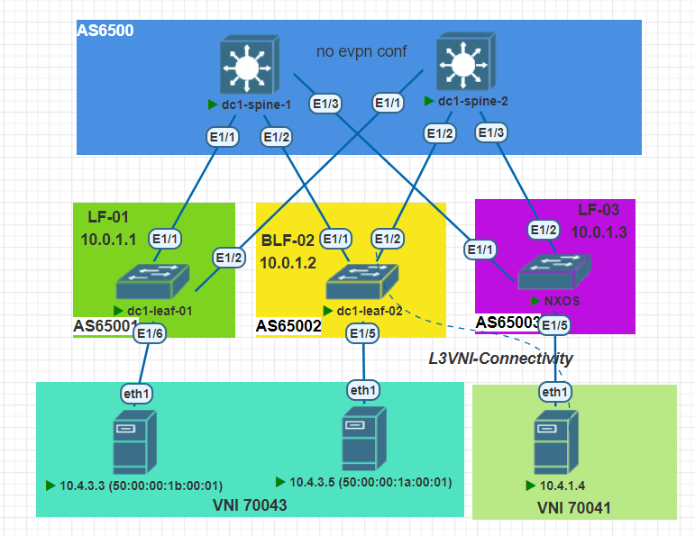

## VxLAN. EVPN-L3

#### Цель:
Настроить маршрутизацию в рамках Overlay между клиентами


**Описание/Пошаговая инструкция выполнения домашнего задания:**   
* Настроить каждого клиента в своем VNI
* Настроить маршрутизацию между клиентами
* План работы, адресное пространство, схема сети, настройки - зафиксированы в документации


**Общие характеристики сети**  
* **Топология** - Сеть Клоса
* **Уровней коммутации** - 2 (Spine,Leaf)
* **Протокол underlay маршрутизации** - eBGP
* **Spine AS** - одна;
* **Leaf AS** - уникальные;
* **Overlay** - BGP L2VPN;
* **VxLAN-cfg** - *только на Leaf нодах*;
* **Образ** - NxOS 9.3

**Параметры BGP** (bold means not default)
* BGP feature - *Enabled*
* Reconnect-interval *12*
* Keep alive interval - *3 seconds*
* Hold timer - *9 seconds*
* BGP PIC core - enabled
* Auto-summary - Always disabled
* Synchronization - Always disabled
* Dynamic capability - enabled
* BGP additional paths - *Enabled*
* ECMP - maximum path - 64
* bestpath - multipath-relax 

**Параметры VxLAN**
* Модель сервиса - VLAN based (Router EVPN-L3)
* VRF - default
* EVPN-VRF - PROD
* update-source - loopback1
* ebgp-multihop - 3
* Тип VxLAN-L3 туннелирования - симметричный
* RD - Ручная настройка
* RT - auto
* BUM - ingress replication bgp


#### План настройки eBGP: 

+ Шаг-1 - Настройка route-map для редистрибьюции;
+ Шаг-2 - Включить BGP feature на устройстве;
+ Шаг-3 - Создать BGP инстанс (AS); 
+ Шаг-4 - Настройка BGP опций 
+ Шаг-5 - Настройка шаблонов конфигурации соседств (leaf-side);
+ Шаг-6 - Объявление соседей;
+ Шаг-7 - Проверить связность сетей.

#### План настройки vXLAN:
+ Шаг-1 - Включить evpn-feature на коммутаторах;
+ Шаг-2 - Настройка VLAN и vn-segment
+ Шаг-3 - Настройка VNI
+ Шаг-4 - Настройка RD и RT-auto
+ Шаг-5 - Настройка NVE на Lo1 и указание участников  
+ Шаг-6 - Настройка BGP на VTEP
+ Шаг-7 - Настройка VRF, добавление L3VNI
+ Шаг-8 - Проверка работы VxLAN EVI


**Перечень ASN для маршрутизаторов**

|Dev-Name   |AS    |RID       |#Комментарий        |
|:---------:|:----:|:--------:|--------------------|
|dc1-spine-1| 65000| 10.0.1.0 | #Lo1-Spine1        |
|dc1-spine-2| 65000| 10.0.2.0 | #Lo1-Spine2        |
|dc1-leaf-01| 65001| 10.0.1.1 | #Lo1-Leaf1         |
|dc1-leaf-02| 65002| 10.0.1.2 | #Lo1-Leaf2         |
|dc1-leaf-03| 65003| 10.0.1.3 | #Lo1-Leaf3         |

**Перечень RD\VNI для маршрутизаторов**
|   VNI |Type|Dev-Name   |AS    |RD              |#Комментарий       |
|:-----:|:----:|:---------:|:----:|:--------------:|-------------------|
| 70041 |L2		 |dc1-leaf-01| 65001| 10.0.1.1:32808 | #RD-Leaf1         |
| 70041 |L2      |dc1-leaf-02| 65002| 10.0.1.2:32808 | #RD-Leaf2         |
| 70041 |L2      |dc1-leaf-03| 65003| 10.0.1.3:32808 | #RD-Leaf3         |
| 70043 |L2      |dc1-leaf-01| 65001| 10.0.1.1:65003 | #RD-Leaf1         |
| 70043 |L2      |dc1-leaf-02| 65002| 10.0.1.2:65003 | #RD-Leaf2         |
| 70043 |L2      |dc1-leaf-03| 65003| 10.0.1.3:65003 | #RD-Leaf3         |
| 10000 |L3      |dc1-leaf-XX| 6500X| 10.0.1.X:10000 | #RD-Leafall		|

#### Схема




**Адресный план:**

#### Адресация для хостов
|Dev-Name   |Pn   |Dn           |Sn    |Xn    |Mask|#Комментарий              |
|:---------:|:---:|:-----------:|:----:|:----:|:--:|--------------------------|
|dc1-lf1-srv-01| 10  |    4        |  3   |   3  | /24| #ip-dc1-lf1-srv-01    |
|dc1-lf2-srv-01| 10  |    4        |  3   |   5  | /24| #ip-dc1-lf2-srv-01    |
|dc1-lf3-srv-01| 10  |    4        |  1   |   4  | /24| #ip-dc1-lf3-srv-01    |

#### Адресация Loopback интерфейсов

|Dev-Name   |Pn   |Dn           |Sn    |Xn    |Mask|#Комментарий              |
|:---------:|:---:|:-----------:|:----:|:----:|:--:|--------------------------|
|dc1-spine-1| 10  |    0        |  1   |   0  | /32| #Loopback1-Spine1        |
|dc1-spine-2| 10  |    0        |  2   |   0  | /32| #Loopback1-Spine2        |
|dc1-spine-1| 10  |    1        |  1   |   0  | /32| #Loopback2-Spine1        |
|dc1-spine-2| 10  |    1        |  2   |   0  | /32| #Loopback2-Spine2        |
|dc1-leaf-01| 10  |    0        |  1   |   1  | /32| #Loopback1-Leaf1         |
|dc1-leaf-02| 10  |    0        |  1   |   2  | /32| #Loopback1-Leaf2         |
|dc1-leaf-03| 10  |    0        |  1   |   3  | /32| #Loopback1-Leaf3         |
|dc1-leaf-01| 10  |    1        |  2   |   1  | /32| #Loopback2-Leaf1         |
|dc1-leaf-02| 10  |    1        |  2   |   2  | /32| #Loopback2-Leaf2         |
|dc1-leaf-03| 10  |    1        |  2   |   3  | /32| #Loopback2-Leaf3         |

#### Адресация интерфейсов PtP соединений

|Dev-Name   |Pn   |Dn           |Sn    |Xn    |Mask|#Комментарий              |
|:---------:|:---:|:-----------:|:----:|:----:|:--:|--------------------------|
|dc1-spine-1| 10  |    2        |  1   |   0  | /32| #p2p-link-from-dc1-leaf-01-to-dc1-spine-1|
|dc1-leaf-01| 10  |    2        |  1   |   1  | /32| #p2p-link-from-dc1-leaf-01-to-dc1-spine-1|
|dc1-spine-1| 10  |    2        |  1   |   2  | /32| #p2p-link-from-dc1-leaf-02-to-dc1-spine-1|
|dc1-leaf-02| 10  |    2        |  1   |   3  | /32| #p2p-link-from-dc1-leaf-02-to-dc1-spine-1|
|dc1-spine-1| 10  |    2        |  1   |   4  | /32| #p2p-link-from-dc1-leaf-03-to-dc1-spine-1|
|dc1-leaf-03| 10  |    2        |  1   |   5  | /32| #p2p-link-from-dc1-leaf-03-to-dc1-spine-1|
|dc1-spine-2| 10  |    2        |  2   |   0  | /32| #p2p-link-from-dc1-leaf-01-to-dc1-spine-2|
|dc1-leaf-01| 10  |    2        |  2   |   1  | /32| #p2p-link-from-dc1-leaf-01-to-dc1-spine-2|
|dc1-spine-2| 10  |    2        |  2   |   2  | /32| #p2p-link-from-dc1-leaf-02-to-dc1-spine-2|
|dc1-leaf-02| 10  |    2        |  2   |   3  | /32| #p2p-link-from-dc1-leaf-02-to-dc1-spine-2|
|dc1-spine-2| 10  |    2        |  2   |   4  | /32| #p2p-link-from-dc1-leaf-03-to-dc1-spine-2|
|dc1-leaf-03| 10  |    2        |  2   |   5  | /32| #p2p-link-from-dc1-leaf-03-to-dc1-spine-2|

#### Проверка работы VxLAN:

*Проверка работы сервера 10.4.3.3 в L2VPN VNI 70043*
```
eth1: flags=4163<UP,BROADCAST,RUNNING,MULTICAST>  mtu 1500
        inet 10.4.3.3  netmask 255.255.255.0  broadcast 0.0.0.0
        ether 50:00:00:1b:00:01  txqueuelen 1000  (Ethernet)
        RX packets 18134  bytes 1324310 (1.3 MB)
        RX errors 0  dropped 0  overruns 0  frame 0
        TX packets 17429  bytes 1553930 (1.5 MB)
        TX errors 0  dropped 0 overruns 0  carrier 0  collisions 0

root@10:/home# ping 10.4.3.5 -c 5
PING 10.4.3.5 (10.4.3.5) 56(84) bytes of data.
64 bytes from 10.4.3.5: icmp_seq=1 ttl=64 time=10.7 ms
64 bytes from 10.4.3.5: icmp_seq=2 ttl=64 time=8.54 ms
64 bytes from 10.4.3.5: icmp_seq=3 ttl=64 time=10.6 ms
64 bytes from 10.4.3.5: icmp_seq=4 ttl=64 time=8.36 ms
64 bytes from 10.4.3.5: icmp_seq=5 ttl=64 time=30.1 ms
```
*Проверка доступа с сервера 10.4.3.3, сервера 10.4.1.4 в L3VPN по L3VNI 10000
```
root@10:/home# ping 10.4.1.4 -c 5
PING 10.4.1.4 (10.4.1.4) 56(84) bytes of data.
64 bytes from 10.4.1.4: icmp_seq=1 ttl=63 time=11.9 ms
64 bytes from 10.4.1.4: icmp_seq=2 ttl=63 time=22.6 ms
64 bytes from 10.4.1.4: icmp_seq=3 ttl=63 time=10.8 ms
64 bytes from 10.4.1.4: icmp_seq=4 ttl=63 time=11.1 ms
64 bytes from 10.4.1.4: icmp_seq=5 ttl=63 time=11.5 ms

*Проверка доступности шлюза из сети 10.4.2.0/24
root@10:/home# ping 10.4.2.254 -c 5
PING 10.4.2.254 (10.4.2.254) 56(84) bytes of data.
64 bytes from 10.4.2.254: icmp_seq=1 ttl=255 time=14.6 ms
64 bytes from 10.4.2.254: icmp_seq=2 ttl=255 time=1.49 ms
64 bytes from 10.4.2.254: icmp_seq=3 ttl=255 time=1.90 ms
64 bytes from 10.4.2.254: icmp_seq=4 ttl=255 time=1.65 ms
64 bytes from 10.4.2.254: icmp_seq=5 ttl=255 time=6.73 ms
```
Таблица маршрутов EVPN
```
dc1-leaf-02# show bgp l2vpn evpn 
BGP routing table information for VRF default, address family L2VPN EVPN
BGP table version is 232, Local Router ID is 10.0.1.2
Status: s-suppressed, x-deleted, S-stale, d-dampened, h-history, *-valid, >-best
Path type: i-internal, e-external, c-confed, l-local, a-aggregate, r-redist, I-i
njected
Origin codes: i - IGP, e - EGP, ? - incomplete, | - multipath, & - backup, 2 - b
est2

   Network            Next Hop            Metric     LocPrf     Weight Path
Route Distinguisher: 10.0.1.1:10041
*>e[3]:[0]:[32]:[10.0.1.1]/88
                      10.0.1.1                                       0 65001 i
* e                   10.0.1.1                                       0 65003 650
01 i

Route Distinguisher: 10.0.1.1:10042
*>e[3]:[0]:[32]:[10.0.1.1]/88
                      10.0.1.1                                       0 65001 i
* e                   10.0.1.1                                       0 65003 650
01 i

Route Distinguisher: 10.0.1.1:10043
*>e[2]:[0]:[0]:[48]:[5000.001a.0001]:[0]:[0.0.0.0]/216
                      10.0.1.1                                       0 65001 i
* e                   10.0.1.1                                       0 65003 650
01 i
*>e[3]:[0]:[32]:[10.0.1.1]/88
                      10.0.1.1                                       0 65001 i
* e                   10.0.1.1                                       0 65003 650
01 i

Route Distinguisher: 10.0.1.2:10041    (L2VNI 10041)
*>e[2]:[0]:[0]:[48]:[5000.001d.0001]:[0]:[0.0.0.0]/216
                      10.0.1.3                                       0 65003 i
*>e[3]:[0]:[32]:[10.0.1.1]/88
                      10.0.1.1                                       0 65001 i
*>l[3]:[0]:[32]:[10.0.1.2]/88
                      10.0.1.2                          100      32768 i
*>e[3]:[0]:[32]:[10.0.1.3]/88
                      10.0.1.3                                       0 65003 i

Route Distinguisher: 10.0.1.2:10042    (L2VNI 10042)
*>e[3]:[0]:[32]:[10.0.1.1]/88
                      10.0.1.1                                       0 65001 i
*>l[3]:[0]:[32]:[10.0.1.2]/88
                      10.0.1.2                          100      32768 i
*>e[3]:[0]:[32]:[10.0.1.3]/88
                      10.0.1.3                                       0 65003 i

Route Distinguisher: 10.0.1.2:10043    (L2VNI 10043)
*>e[2]:[0]:[0]:[48]:[5000.001a.0001]:[0]:[0.0.0.0]/216
                      10.0.1.1                                       0 65001 i
*>l[2]:[0]:[0]:[48]:[5000.001b.0001]:[0]:[0.0.0.0]/216
                      10.0.1.2                          100      32768 i
*>e[3]:[0]:[32]:[10.0.1.1]/88
                      10.0.1.1                                       0 65001 i
*>l[3]:[0]:[32]:[10.0.1.2]/88
                      10.0.1.2                          100      32768 i
*>e[3]:[0]:[32]:[10.0.1.3]/88
                      10.0.1.3                                       0 65003 i

Route Distinguisher: 10.0.1.3:10041
*>e[2]:[0]:[0]:[48]:[5000.001d.0001]:[0]:[0.0.0.0]/216
                      10.0.1.3                                       0 65003 i
* e                   10.0.1.3                                       0 65001 650
03 i
*>e[3]:[0]:[32]:[10.0.1.3]/88
                      10.0.1.3                                       0 65003 i
* e                   10.0.1.3                                       0 65001 650
03 i

Route Distinguisher: 10.0.1.3:10042
*>e[3]:[0]:[32]:[10.0.1.3]/88
                      10.0.1.3                                       0 65003 i
* e                   10.0.1.3                                       0 65001 650
03 i

Route Distinguisher: 10.0.1.3:10043
*>e[3]:[0]:[32]:[10.0.1.3]/88
                      10.0.1.3                                       0 65003 i
* e                   10.0.1.3                                       0 65001 650
03 i
```