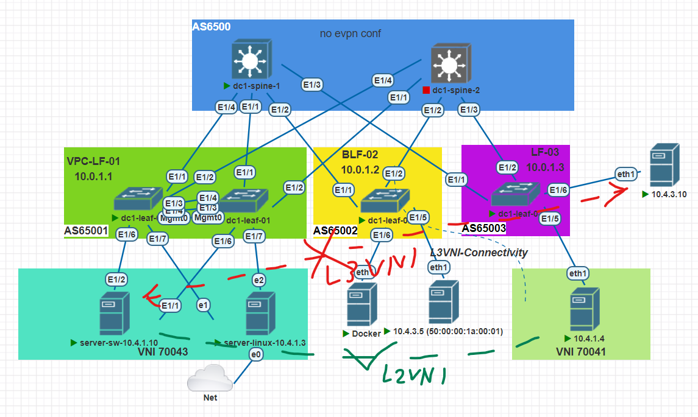

## VxLAN. + VPC

#### Цель:
Настроить маршрутизацию в рамках Overlay между клиентами


**Описание/Пошаговая инструкция выполнения домашнего задания:**   
* Подключить клиентов 2-я линками к различным Leaf
* Настроить агрегированный канал со стороны клиента
* Настроить VPC для работы в Overlay сети
* План работы, адресное пространство, схема сети, настройки - зафиксированы в документации


**Общие характеристики сети**  
* **Топология** - Сеть Клоса
* **Уровней коммутации** - 2 (Spine,Leaf)
* **Протокол underlay маршрутизации** - eBGP
* **Spine AS** - одна;
* **Leaf AS** - уникальные;
* **Overlay** - BGP L2VPN;
* **VxLAN-cfg** - *только на Leaf нодах*;
* **Образ** - NxOS 9.3

**Параметры BGP** (bold means not default)
* BGP feature - *Enabled*
* Reconnect-interval *12*
* Keep alive interval - *3 seconds*
* Hold timer - *9 seconds*
* BGP PIC core - enabled
* Auto-summary - Always disabled
* Synchronization - Always disabled
* Dynamic capability - enabled
* BGP additional paths - *Enabled*
* ECMP - maximum path - 64
* bestpath - multipath-relax 

**Параметры VxLAN**
* Модель сервиса - VLAN based (Router EVPN-L3)
* VRF - default
* EVPN-VRF - PROD
* update-source - loopback1
* ebgp-multihop - 3
* Тип VxLAN-L3 туннелирования - симметричный
* RD - Ручная настройка
* RT - auto
* BUM - ingress replication bgp

**Параметры VPC**
* VPC-domain - 1 пара в связи с производительностью тестовой среды
* peer-switch - enabled
* peer-keepalive - vrf-management
* peer-gateway - enabled
* auto-recovery - enabled
* ip arp synchronize - enabled
* layer3 peer-router - enabled


#### План настройки eBGP: 

+ Шаг-1 - Настройка route-map для редистрибьюции;
+ Шаг-2 - Включить BGP feature на устройстве;
+ Шаг-3 - Создать BGP инстанс (AS); 
+ Шаг-4 - Настройка BGP опций 
+ Шаг-5 - Настройка шаблонов конфигурации соседств (leaf-side);
+ Шаг-6 - Объявление соседей;
+ Шаг-7 - Проверить связность сетей.

#### План настройки vXLAN:
+ Шаг-1 - Включить evpn-feature на коммутаторах;
+ Шаг-2 - Настройка VLAN и vn-segment
+ Шаг-3 - Настройка VNI
+ Шаг-4 - Настройка RD и RT-auto
+ Шаг-5 - Настройка NVE на Lo1 и указание участников  
+ Шаг-6 - Настройка BGP на VTEP
+ Шаг-7 - Настройка VRF, добавление L3VNI
+ Шаг-8 - Проверка работы VxLAN EVI

#### План настройки VPC:

+ Шаг-1 - Включить feature lacp+vpc для коммутаторов
+ Шаг-2 - Настройка VPC-Domain и приоритетов для коммутаторов
+ Шаг-3 - Настройка secondary IP для VxLAN loopback1
+ Шаг-4 - Настройка VPC-link в сторону серверов
+ Шаг-5 - Проверка работы.


**Параметры VPC для коммутаторов**
|Dev-Name   |VPC-D |Role-pri  |#Комментарий        |
|:---------:|:----:|:--------:|--------------------|
|dc1-leaf-01|14    |100 | #dst-sw-for-vlan41-srv|
|dc1-leaf-04|14    |200 | #dst-sw-for-vlan41-srv|


**Перечень ASN для маршрутизаторов**

|Dev-Name   |AS    |   RID    | #Комментарий |
|:---------:|:----:|:--------:|--------------|
|dc1-spine-1| 65000| 10.0.1.0 | #Lo1-Spine1  |
|dc1-spine-2| 65000| 10.0.2.0 | #Lo1-Spine2  |
|dc1-leaf-01| 65001| 10.0.1.1 | #Lo1-Leaf1   |
|dc1-leaf-01| 65001| 10.0.1.4 | #Lo1-Leaf4   |
|dc1-leaf-02| 65002| 10.0.1.2 | #Lo1-Leaf2   |
|dc1-leaf-03| 65003| 10.0.1.3 | #Lo1-Leaf3   |

**Перечень RD\VNI для маршрутизаторов**
|   VNI |Type|Dev-Name   |AS    |RD              |#Комментарий       |
|:-----:|:----:|:---------:|:----:|:--------------:|-------------------|
| 70041 |L2		 |dc1-leaf-01| 65001| 10.0.1.141:32808 | #RD-Leaf1         |
| 70041 |L2		 |dc1-leaf-04| 65001| 10.0.1.141:32808 | #RD-Leaf1         |
| 70041 |L2      |dc1-leaf-02| 65002| 10.0.1.2:32808 | #RD-Leaf2         |
| 70041 |L2      |dc1-leaf-03| 65003| 10.0.1.3:32808 | #RD-Leaf3         |
| 70043 |L2      |dc1-leaf-01| 65001| 10.0.1.1:65003 | #RD-Leaf1         |
| 70043 |L2      |dc1-leaf-02| 65002| 10.0.1.2:65003 | #RD-Leaf2         |
| 70043 |L2      |dc1-leaf-03| 65003| 10.0.1.3:65003 | #RD-Leaf3         |
| 10000 |L3      |dc1-leaf-XX| 6500X| 10.0.1.X:10000 | #RD-Leafall		|

#### Схема




**Адресный план:**

#### Адресация для хостов
|Dev-Name   |Pn   |Dn           |Sn    |Xn    |Mask|#Комментарий              |
|:---------:|:---:|:-----------:|:----:|:----:|:--:|--------------------------|
|dc1-lf1-srv-01| 10  |    4        |  3   |   3  | /24| #ip-dc1-lf1-srv-01    |
|dc1-lf2-srv-01| 10  |    4        |  3   |   5  | /24| #ip-dc1-lf2-srv-01    |
|dc1-lf3-srv-01| 10  |    4        |  1   |   4  | /24| #ip-dc1-lf3-srv-01    |

#### Адресация Loopback интерфейсов

|Dev-Name   |Pn   |Dn           |Sn    |Xn    |Mask|#Комментарий              |
|:---------:|:---:|:-----------:|:----:|:----:|:--:|--------------------------|
|dc1-spine-1| 10  |    0        |  1   |   0  | /32| #Loopback1-Spine1        |
|dc1-spine-2| 10  |    0        |  2   |   0  | /32| #Loopback1-Spine2        |
|dc1-spine-1| 10  |    1        |  1   |   0  | /32| #Loopback2-Spine1        |
|dc1-spine-2| 10  |    1        |  2   |   0  | /32| #Loopback2-Spine2        |
|dc1-leaf-01| 10  |    0        |  1   |   1  | /32| #Loopback1-Leaf1         |
|dc1-leaf-02| 10  |    0        |  1   |   2  | /32| #Loopback1-Leaf2         |
|dc1-leaf-03| 10  |    0        |  1   |   3  | /32| #Loopback1-Leaf3         |
|dc1-leaf-01| 10  |    1        |  2   |   1  | /32| #Loopback2-Leaf1         |
|dc1-leaf-02| 10  |    1        |  2   |   2  | /32| #Loopback2-Leaf2         |
|dc1-leaf-03| 10  |    1        |  2   |   3  | /32| #Loopback2-Leaf3         |

#### Адресация интерфейсов PtP соединений

|Dev-Name   |Pn   |Dn           |Sn    |Xn    |Mask|#Комментарий              |
|:---------:|:---:|:-----------:|:----:|:----:|:--:|--------------------------|
|dc1-spine-1| 10  |    2        |  1   |   0  | /32| #p2p-link-from-dc1-leaf-01-to-dc1-spine-1|
|dc1-leaf-01| 10  |    2        |  1   |   1  | /32| #p2p-link-from-dc1-leaf-01-to-dc1-spine-1|
|dc1-spine-1| 10  |    2        |  1   |   2  | /32| #p2p-link-from-dc1-leaf-02-to-dc1-spine-1|
|dc1-leaf-02| 10  |    2        |  1   |   3  | /32| #p2p-link-from-dc1-leaf-02-to-dc1-spine-1|
|dc1-spine-1| 10  |    2        |  1   |   4  | /32| #p2p-link-from-dc1-leaf-03-to-dc1-spine-1|
|dc1-leaf-03| 10  |    2        |  1   |   5  | /32| #p2p-link-from-dc1-leaf-03-to-dc1-spine-1|
|dc1-spine-2| 10  |    2        |  2   |   0  | /32| #p2p-link-from-dc1-leaf-01-to-dc1-spine-2|
|dc1-leaf-01| 10  |    2        |  2   |   1  | /32| #p2p-link-from-dc1-leaf-01-to-dc1-spine-2|
|dc1-spine-2| 10  |    2        |  2   |   2  | /32| #p2p-link-from-dc1-leaf-02-to-dc1-spine-2|
|dc1-leaf-02| 10  |    2        |  2   |   3  | /32| #p2p-link-from-dc1-leaf-02-to-dc1-spine-2|
|dc1-spine-2| 10  |    2        |  2   |   4  | /32| #p2p-link-from-dc1-leaf-03-to-dc1-spine-2|
|dc1-leaf-03| 10  |    2        |  2   |   5  | /32| #p2p-link-from-dc1-leaf-03-to-dc1-spine-2|

```
interface Ethernet1/3
  description p2p-link-from-dc1-leaf-04-to-dc1-spine-1
  no switchport
  ip address 10.2.1.6/31
  no shutdown

  neighbor 10.2.1.7
    remote-as 65001
    timers 3 9
    address-family ipv4 unicast


 neighbor 10.0.1.1
    remote-as 65001
    update-source loopback1
    ebgp-multihop 3
    address-family l2vpn evpn
      send-community
      send-community extended
      route-map UNCHANGED out

 neighbor 10.0.1.4
    remote-as 65001
    update-source loopback1
    ebgp-multihop 3
    address-family l2vpn evpn
      send-community
      send-community extended
      route-map UNCHANGED out
	  
	  
evpn
  vni 10041 l2
    rd 10.0.1.141:10041
    route-target import auto
    route-target export auto
  vni 10042 l2
    rd 10.0.1.141:10042
    route-target import auto
    route-target export auto
  vni 10043 l2
    rd 10.0.1.141:10043
    route-target import auto
    route-target export auto

vrf context PROD
  vni 10000
  rd 10.0.1.141:10000
  address-family ipv4 unicast
    route-target both auto
    route-target both auto evpn
```	
#### Проверка работы VPC:

*Вывод информации о VPC*
```
dc1-leaf-04# show vpc 
Legend:
                (*) - local vPC is down, forwarding via vPC peer-link

vPC domain id                     : 14  
Peer status                       : peer adjacency formed ok      
vPC keep-alive status             : peer is alive                 
Configuration consistency status  : success 
Per-vlan consistency status       : success                       
Type-2 consistency status         : success 
vPC role                          : secondary, operational primary
Number of vPCs configured         : 2   
Peer Gateway                      : Enabled
Dual-active excluded VLANs        : -
Graceful Consistency Check        : Enabled
Auto-recovery status              : Enabled, timer is off.(timeout = 240s)
Delay-restore status              : Timer is off.(timeout = 240s)
Delay-restore SVI status          : Timer is off.(timeout = 80s)
Operational Layer3 Peer-router    : Disabled
Virtual-peerlink mode             : Disabled

vPC Peer-link status
---------------------------------------------------------------------
id    Port   Status Active vlans    
--    ----   ------ -------------------------------------------------
1     Po1000 up     1,41-43,1000                                                
         

vPC status
----------------------------------------------------------------------------
Id    Port          Status Consistency Reason                Active vlans
--    ------------  ------ ----------- ------                ---------------
6     Po6           up     success     success               41                 
         
                                                                                
         
7     Po7           up     success     success               41       
```