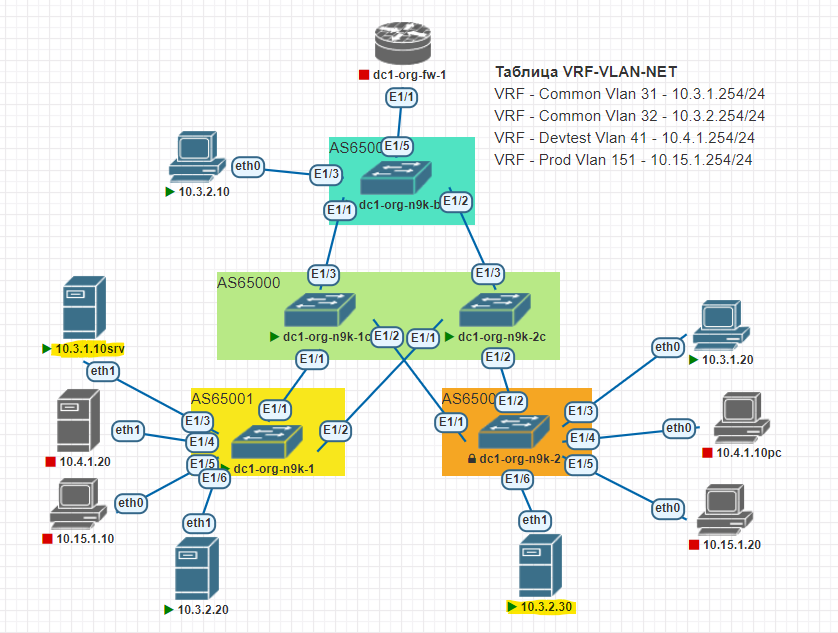

## Диагностика прохождения трафика в L3VNI

**Цель:** Проверка работы L3VNI посредством ping На прохождение трафика между узлами 10.3.1.10 и 10.3.2.30

**Схема:**



**Результат:** Нестабильное прохождение трафика, потери при отправке до 90%
```
10.3.1.10:/# ping 10.3.2.30
PING 10.3.2.30 (10.3.2.30) 56(84) bytes of data.
64 bytes from 10.3.2.30: icmp_seq=19 ttl=63 time=12.4 ms
64 bytes from 10.3.2.30: icmp_seq=20 ttl=63 time=10.9 ms
64 bytes from 10.3.2.30: icmp_seq=21 ttl=63 time=16.2 ms
64 bytes from 10.3.2.30: icmp_seq=22 ttl=63 time=16.2 ms
^C
--- 10.3.2.30 ping statistics ---
26 packets transmitted, 4 received, 84.6154% packet loss, time 25490ms
rtt min/avg/max/mdev = 10.932/13.939/16.198/2.318 ms

10.3.2.30:/home# ping 10.3.1.10
PING 10.3.1.10 (10.3.1.10) 56(84) bytes of data.
64 bytes from 10.3.1.10: icmp_seq=15 ttl=63 time=22.5 ms
64 bytes from 10.3.1.10: icmp_seq=16 ttl=63 time=11.5 ms
64 bytes from 10.3.1.10: icmp_seq=17 ttl=63 time=23.2 ms
64 bytes from 10.3.1.10: icmp_seq=18 ttl=63 time=24.6 ms
64 bytes from 10.3.1.10: icmp_seq=19 ttl=63 time=29.8 ms
^C
--- 10.3.1.10 ping statistics ---
21 packets transmitted, 5 received, 76.1905% packet loss, time 20334ms
rtt min/avg/max/mdev = 11.521/22.347/29.803/5.980 ms
```

**Описание:** в процессе проверки конфигурации был выполнен Ping тест для проверки доступности нод
VRF-Common через взаимодействие посредством L3VNI. В процессе тестирования выявлены проблемы
с прохождением трафика ICMP вследствие неизвестных причин. L2 взаимодействие между нодами работает без проблем.

**Команды диагностики:**

dc1-org-n9k-1# show l2route mac-ip all
```
Flags -(Rmac):Router MAC (Stt):Static (L):Local (R):Remote (V):vPC link 
(Dup):Duplicate (Spl):Split (Rcv):Recv(D):Del Pending (S):Stale (C):Clear
(Ps):Peer Sync (Ro):Re-Originated (Orp):Orphan 
Topology    Mac Address    Host IP                                 Prod   Flags 
        Seq No     Next-Hops                              
----------- -------------- --------------------------------------- ------ ------
---- ---------- ---------------------------------------
31          5000.000f.0001 10.3.1.10                               HMM    L,    
        0         Local                                  
32          5000.0014.0001 10.3.2.20                               HMM    L,    
        0         Local                                  
32          5000.0015.0001 10.3.2.30                               BGP    --    
        0         10.1.2.2 (Label: 10032)          
```

dc1-org-n9k-2# show l2route mac-ip all
```
Flags -(Rmac):Router MAC (Stt):Static (L):Local (R):Remote (V):vPC link 
(Dup):Duplicate (Spl):Split (Rcv):Recv(D):Del Pending (S):Stale (C):Clear
(Ps):Peer Sync (Ro):Re-Originated (Orp):Orphan 
Topology    Mac Address    Host IP                                 Prod   Flags 
        Seq No     Next-Hops                              
----------- -------------- --------------------------------------- ------ ------
---- ---------- ---------------------------------------
31          5000.000f.0001 10.3.1.10                               BGP    --    
        0         10.1.2.1 (Label: 10031)                
32          5000.0014.0001 10.3.2.20                               BGP    --    
        0         10.1.2.1 (Label: 10032)                
32          5000.0015.0001 10.3.2.30                               HMM    L,    
        0         Local                                  
```

dc1-org-n9k-1# show bgp l2vpn evpn 10.3.1.10
```
BGP routing table information for VRF default, address family L2VPN EVPN
Route Distinguisher: 10.1.2.1:1    (L2VNI 10031)
BGP routing table entry for [2]:[0]:[0]:[48]:[5000.000f.0001]:[32]:[10.3.1.10]/2
72, version 29
Paths: (1 available, best #1)
Flags: (0x000102) (high32 00000000) on xmit-list, is not in l2rib/evpn

  Advertised path-id 1
  Path type: local, path is valid, is best path, no labeled nexthop
  AS-Path: NONE, path locally originated
    10.1.2.1 (metric 0) from 0.0.0.0 (10.0.1.1)
      Origin IGP, MED not set, localpref 100, weight 32768
      Received label 10031 10000
      Extcommunity: RT:1:10031 RT:65001:10000 ENCAP:8 Router MAC:5000.0200.1b08

  Path-id 1 advertised to peers:
    10.1.1.0           10.1.2.0       
```
dc1-org-n9k-1# show bgp l2vpn evpn 10.3.2.30
```
BGP routing table information for VRF default, address family L2VPN EVPN
Route Distinguisher: 10.1.2.1:132    (L2VNI 10032)
BGP routing table entry for [2]:[0]:[0]:[48]:[5000.0015.0001]:[32]:[10.3.2.30]/2
72, version 121
Paths: (1 available, best #1)
Flags: (0x000212) (high32 00000000) on xmit-list, is in l2rib/evpn, is not in HW

  Advertised path-id 1
  Path type: external, path is valid, is best path, no labeled nexthop, in rib
             Imported from 10.1.2.2:132:[2]:[0]:[0]:[48]:[5000.0015.0001]:[32]:[
10.3.2.30]/272 
  AS-Path: 65000 65002 , path sourced external to AS
    10.1.2.2 (metric 0) from 10.1.2.0 (10.0.2.0)
      Origin IGP, MED not set, localpref 100, weight 0
      Received label 10032 10000
      Extcommunity: RT:1:10032 RT:65002:10000 ENCAP:8 Router MAC:5000.1100.1b08

  Path-id 1 not advertised to any peer

Route Distinguisher: 10.1.2.2:132
BGP routing table entry for [2]:[0]:[0]:[48]:[5000.0015.0001]:[32]:[10.3.2.30]/2
72, version 128
Paths: (2 available, best #2)
Flags: (0x000202) (high32 00000000) on xmit-list, is not in l2rib/evpn, is not i
n HW

  Path type: external, path is valid, not best reason: newer EBGP path, no label
ed nexthop
  AS-Path: 65000 65002 , path sourced external to AS
    10.1.2.2 (metric 0) from 10.1.1.0 (10.0.1.0)
      Origin IGP, MED not set, localpref 100, weight 0
      Received label 10032 10000
      Extcommunity: RT:1:10032 RT:65002:10000 ENCAP:8 Router MAC:5000.1100.1b08

  Advertised path-id 1
  Path type: external, path is valid, is best path, no labeled nexthop
             Imported to 1 destination(s)
             Imported paths list: L2-10032
  AS-Path: 65000 65002 , path sourced external to AS
    10.1.2.2 (metric 0) from 10.1.2.0 (10.0.2.0)
      Origin IGP, MED not set, localpref 100, weight 0
      Received label 10032 10000
      Extcommunity: RT:1:10032 RT:65002:10000 ENCAP:8 Router MAC:5000.1100.1b08

  Path-id 1 not advertised to any peer
  
```


dc1-org-n9k-2# show bgp l2vpn evpn 10.3.1.10
```
BGP routing table information for VRF default, address family L2VPN EVPN
Route Distinguisher: 10.1.2.1:1
BGP routing table entry for [2]:[0]:[0]:[48]:[5000.000f.0001]:[32]:[10.3.1.10]/2
72, version 144
Paths: (2 available, best #2)
Flags: (0x000202) (high32 00000000) on xmit-list, is not in l2rib/evpn, is not i
n HW

  Path type: external, path is valid, not best reason: newer EBGP path, no label
ed nexthop
  AS-Path: 65000 65001 , path sourced external to AS
    10.1.2.1 (metric 0) from 10.1.1.0 (10.0.1.0)
      Origin IGP, MED not set, localpref 100, weight 0
      Received label 10031 10000
      Extcommunity: RT:1:10031 RT:65001:10000 ENCAP:8 Router MAC:5000.0200.1b08

  Advertised path-id 1
  Path type: external, path is valid, is best path, no labeled nexthop
             Imported to 1 destination(s)
             Imported paths list: L2-10031
  AS-Path: 65000 65001 , path sourced external to AS
    10.1.2.1 (metric 0) from 10.1.2.0 (10.0.2.0)
      Origin IGP, MED not set, localpref 100, weight 0
      Received label 10031 10000
      Extcommunity: RT:1:10031 RT:65001:10000 ENCAP:8 Router MAC:5000.0200.1b08

  Path-id 1 not advertised to any peer

Route Distinguisher: 10.1.2.2:1    (L2VNI 10031)
BGP routing table entry for [2]:[0]:[0]:[48]:[5000.000f.0001]:[32]:[10.3.1.10]/2
72, version 131
Paths: (1 available, best #1)
Flags: (0x000212) (high32 00000000) on xmit-list, is in l2rib/evpn, is not in HW

  Advertised path-id 1
  Path type: external, path is valid, is best path, no labeled nexthop, in rib
             Imported from 10.1.2.1:1:[2]:[0]:[0]:[48]:[5000.000f.0001]:[32]:[10
.3.1.10]/272 
  AS-Path: 65000 65001 , path sourced external to AS
    10.1.2.1 (metric 0) from 10.1.2.0 (10.0.2.0)
      Origin IGP, MED not set, localpref 100, weight 0
      Received label 10031 10000
      Extcommunity: RT:1:10031 RT:65001:10000 ENCAP:8 Router MAC:5000.0200.1b08

  Path-id 1 not advertised to any peer
```
dc1-org-n9k-2# show bgp l2vpn evpn 10.3.2.30
```
BGP routing table information for VRF default, address family L2VPN EVPN
Route Distinguisher: 10.1.2.2:132    (L2VNI 10032)
BGP routing table entry for [2]:[0]:[0]:[48]:[5000.0015.0001]:[32]:[10.3.2.30]/2
72, version 6
Paths: (1 available, best #1)
Flags: (0x000102) (high32 00000000) on xmit-list, is not in l2rib/evpn

  Advertised path-id 1
  Path type: local, path is valid, is best path, no labeled nexthop
  AS-Path: NONE, path locally originated
    10.1.2.2 (metric 0) from 0.0.0.0 (10.0.1.2)
      Origin IGP, MED not set, localpref 100, weight 32768
      Received label 10032 10000
      Extcommunity: RT:1:10032 RT:65002:10000 ENCAP:8 Router MAC:5000.1100.1b08

  Path-id 1 advertised to peers:
    10.1.1.0           10.1.2.0       
```
dc1-org-n9k-2# show bgp l2vpn evpn 10.3.1.10
```
BGP routing table information for VRF default, address family L2VPN EVPN
Route Distinguisher: 10.1.2.1:1
BGP routing table entry for [2]:[0]:[0]:[48]:[5000.000f.0001]:[32]:[10.3.1.10]/2
72, version 144
Paths: (2 available, best #2)
Flags: (0x000202) (high32 00000000) on xmit-list, is not in l2rib/evpn, is not i
n HW

  Path type: external, path is valid, not best reason: newer EBGP path, no label
ed nexthop
  AS-Path: 65000 65001 , path sourced external to AS
    10.1.2.1 (metric 0) from 10.1.1.0 (10.0.1.0)
      Origin IGP, MED not set, localpref 100, weight 0
      Received label 10031 10000
      Extcommunity: RT:1:10031 RT:65001:10000 ENCAP:8 Router MAC:5000.0200.1b08

  Advertised path-id 1
  Path type: external, path is valid, is best path, no labeled nexthop
             Imported to 1 destination(s)
             Imported paths list: L2-10031
  AS-Path: 65000 65001 , path sourced external to AS
    10.1.2.1 (metric 0) from 10.1.2.0 (10.0.2.0)
      Origin IGP, MED not set, localpref 100, weight 0
      Received label 10031 10000
      Extcommunity: RT:1:10031 RT:65001:10000 ENCAP:8 Router MAC:5000.0200.1b08

  Path-id 1 not advertised to any peer

Route Distinguisher: 10.1.2.2:1    (L2VNI 10031)
BGP routing table entry for [2]:[0]:[0]:[48]:[5000.000f.0001]:[32]:[10.3.1.10]/2
72, version 131
Paths: (1 available, best #1)
Flags: (0x000212) (high32 00000000) on xmit-list, is in l2rib/evpn, is not in HW

  Advertised path-id 1
  Path type: external, path is valid, is best path, no labeled nexthop, in rib
             Imported from 10.1.2.1:1:[2]:[0]:[0]:[48]:[5000.000f.0001]:[32]:[10
.3.1.10]/272 
  AS-Path: 65000 65001 , path sourced external to AS
    10.1.2.1 (metric 0) from 10.1.2.0 (10.0.2.0)
      Origin IGP, MED not set, localpref 100, weight 0
      Received label 10031 10000
      Extcommunity: RT:1:10031 RT:65001:10000 ENCAP:8 Router MAC:5000.0200.1b08

  Path-id 1 not advertised to any peer
