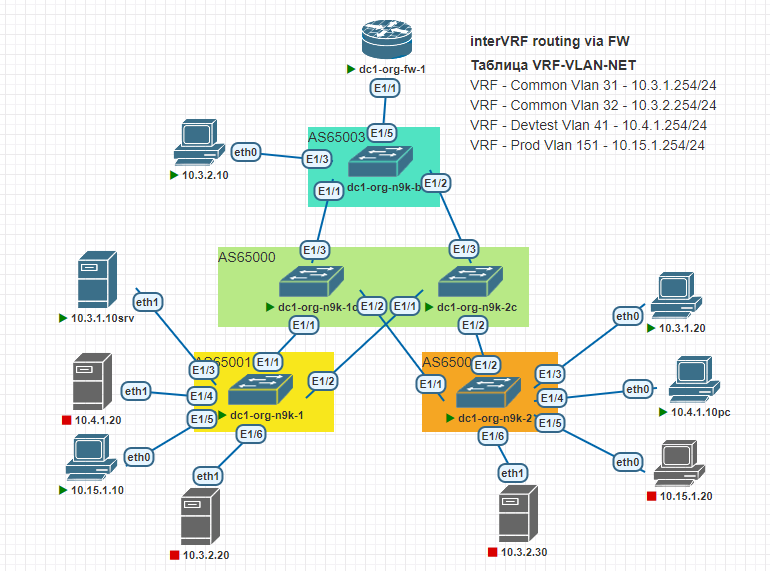

## IP optimisation

#### Цель:
Оптимизировать передачу маршрутной информации


**Описание/Пошаговая инструкция выполнения домашнего задания:**   
* Анонсируете суммарные префиксы клиентов в Overlay сеть
* Настроите маршрутизацию между клиентами через суммарный префикс
* План работы, адресное пространство, схема сети, настройки - зафиксированы в документации
	* Документация оформлена на github в файле Readme.md(markdown). Каждая лабораторная работа находится в своей директории.


**Общие характеристики сети**  
* **Топология** - Clos
* **Уровней коммутации** - 2 (Spine,Leaf)
* **Протокол** - BGP (Underlay\Overlay)
* **Тип BGP сети** - eBGP
* **Spine AS** - одна;
* **Leaf AS** - уникальные;
* **Образ** - NxOS 9.3

**Параметры BGP** (bold means not default)
* BGP feature - *Enabled*
* Reconnect-interval *12*
* Keep alive interval - *3 seconds*
* Hold timer - *9 seconds*
* BGP PIC core - enabled
* Auto-summary - Always disabled
* Synchronization - Always disabled
* Dynamic capability - enabled
* BGP additional paths - *Enabled*
* ECMP - maximum path - 64
* bestpath - multipath-relax 


#### План работ: 

*Сеть VxLAN построена на основе предыдущих лабораторных работ.*

Шаг-1 - Настройка Underlay, Overlay на BGP; \
Шаг-2 - Выполнить настройку L3EVPN с 3 VRF; \
Шаг-3 - Настройка соседства Borderleaf <=> Firewall; \
Шаг-4 - Настройка Export EVPN в ipv4 unicast, в сторону FW; \
Шаг-5 - Настройка аггрегирования маршрутов для оптимизации передачи маршрутной информации; \
Шаг-6 - Настройка хостов; \
Шаг-7 - Проверка связности.


**Перечень ASN для маршрутизаторов**

|Dev-Name   |AS    |    RID    |#Комментарий        |
|:---------:|:----:|:---------:|--------------------|
|dc1-spine-1| 65000| 10.0.1.0  | #Lo1-Spine1        |
|dc1-spine-2| 65000| 10.0.2.0  | #Lo1-Spine2        |
|dc1-leaf-01| 65001| 10.0.1.1  | #Lo1-Leaf1         |
|dc1-leaf-02| 65002| 10.0.1.2  | #Lo1-Leaf2         |
|dc1-leaf-03| 65003| 10.0.1.3  | #Lo1-Leaf3         |
|dc1-org-fw-1| 65100| 10.33.0.1 | #Lo1-fw1        |

#### Схема:



**Адресный план:**

#### Адресация Loopback интерфейсов 

|Dev-Name   |Pn   |Dn           |Sn    |Xn    |Mask|#Комментарий              |
|:---------:|:---:|:-----------:|:----:|:----:|:--:|--------------------------|
|dc1-spine-1| 10  |    0        |  1   |   0  | /32| #Loopback1-Spine1        |
|dc1-spine-2| 10  |    0        |  2   |   0  | /32| #Loopback1-Spine2        |
|dc1-spine-1| 10  |    1        |  1   |   0  | /32| #Loopback2-Spine1        |
|dc1-spine-2| 10  |    1        |  2   |   0  | /32| #Loopback2-Spine2        |
|dc1-leaf-01| 10  |    0        |  1   |   1  | /32| #Loopback1-Leaf1         |
|dc1-leaf-02| 10  |    0        |  1   |   2  | /32| #Loopback1-Leaf2         |
|dc1-leaf-03| 10  |    0        |  1   |   3  | /32| #Loopback1-Leaf3         |
|dc1-leaf-01| 10  |    1        |  2   |   1  | /32| #Loopback2-Leaf1         |
|dc1-leaf-02| 10  |    1        |  2   |   2  | /32| #Loopback2-Leaf2         |
|dc1-leaf-03| 10  |    1        |  2   |   3  | /32| #Loopback2-Leaf3         |
|dc1-leaf-03| 10  |    3        |  0   |   1  | /32| #Loopback2-Leaf3         |

#### Адресация интерфейсов PtP соединений в VRF-Default

|Dev-Name     |Pn   |Dn           |Sn    |Xn    |Mask|#Комментарий              |
|:-----------:|:---:|:-----------:|:----:|:----:|:--:|--------------------------|
|dc1-spine-1  | 10  |    2        |  1   |   0  | /31| #p2p-link-from-dc1-leaf-01-to-dc1-spine-1|
|dc1-leaf-01  | 10  |    2        |  1   |   1  | /31| #p2p-link-from-dc1-leaf-01-to-dc1-spine-1|
|dc1-spine-1  | 10  |    2        |  1   |   2  | /31| #p2p-link-from-dc1-leaf-02-to-dc1-spine-1|
|dc1-leaf-02  | 10  |    2        |  1   |   3  | /31| #p2p-link-from-dc1-leaf-02-to-dc1-spine-1|
|dc1-spine-1  | 10  |    2        |  1   |   4  | /31| #p2p-link-from-dc1-leaf-03-to-dc1-spine-1|
|dc1-leaf-03  | 10  |    2        |  1   |   5  | /31| #p2p-link-from-dc1-leaf-03-to-dc1-spine-1|
|dc1-spine-2  | 10  |    2        |  2   |   0  | /31| #p2p-link-from-dc1-leaf-01-to-dc1-spine-2|
|dc1-leaf-01  | 10  |    2        |  2   |   1  | /31| #p2p-link-from-dc1-leaf-01-to-dc1-spine-2|
|dc1-spine-2  | 10  |    2        |  2   |   2  | /31| #p2p-link-from-dc1-leaf-02-to-dc1-spine-2|
|dc1-leaf-02  | 10  |    2        |  2   |   3  | /31| #p2p-link-from-dc1-leaf-02-to-dc1-spine-2|
|dc1-spine-2  | 10  |    2        |  2   |   4  | /31| #p2p-link-from-dc1-leaf-03-to-dc1-spine-2|
|dc1-leaf-03  | 10  |    2        |  2   |   5  | /31| #p2p-link-from-dc1-leaf-03-to-dc1-spine-2|
|dc1-org-n9k-b1| 10 |    2        |  0   |   1  | /30| #VRF-Common p2p-link-from-dc1-org-n9k-b1-to-ASA     |
|dc1-org-fw-1 | 10  |    2        |  0   |   2  | /30| #VRF-Common p2p-link-from-dc1-org-n9k-b1-to-ASA     |
|dc1-org-n9k-b1| 10 |    2        |  0   |   5  | /30| #VRF-DEVTEST p2p-link-from-dc1-org-n9k-b1-to-ASA     |
|dc1-org-fw-1 | 10  |    2        |  0   |   6  | /30| #VRF-DEVTEST p2p-link-from-dc1-org-n9k-b1-to-ASA     |
|dc1-org-n9k-b1| 10 |    2        |  0   |   9  | /30| #VRF-Prod p2p-link-from-dc1-org-n9k-b1-to-ASA     |
|dc1-org-fw-1| 10  |    2        |  0   |   10  | /30| #VRF-Prod p2p-link-from-dc1-org-n9k-b1-to-ASA     |


#### Адресация для хостов
|Dev-Name   |Pn   |Dn           |Sn    |Xn    |Mask|#Комментарий              |
|:---------:|:---:|:-----------:|:----:|:----:|:--:|--------------------------|
|dc1-lf1-srv-01| 10  |    4        |  3   |   3  | /24| #ip-dc1-lf1-srv-01    |
|dc1-lf2-srv-01| 10  |    4        |  3   |   5  | /24| #ip-dc1-lf2-srv-01    |
|dc1-lf3-srv-01| 10  |    4        |  1   |   4  | /24| #ip-dc1-lf3-srv-01    |


#### Проверка работы протокола:
```
dc1-org-n9k-b1# show nve peers 
Interface Peer-IP                                 State LearnType Uptime   Router-Mac       
--------- --------------------------------------  ----- --------- -------- -----------------
nve1      10.1.2.1                                Up    CP        2d04h    5000.1400.1b08   
nve1      10.1.2.2                                Up    CP        2d04h    5000.1300.1b08   

dc1-org-n9k-1# show nve peers 
Interface Peer-IP                                 State LearnType Uptime   Router-Mac       
--------- --------------------------------------  ----- --------- -------- -----------------
nve1      10.1.2.2                                Up    CP        2d04h    5000.1300.1b08   
nve1      10.1.2.3                                Up    CP        2d04h    5000.0600.1b08   

dc1-org-n9k-2# show nve peers 
Interface Peer-IP                                 State LearnType Uptime   Router-Mac       
--------- --------------------------------------  ----- --------- -------- -----------------
nve1      10.1.2.1                                Up    CP        2d04h    5000.1400.1b08   
nve1      10.1.2.3                                Up    CP        2d04h    5000.0600.1b08   

dc1-org-n9k-b1# show bgp l2vpn evpn summary 
BGP summary information for VRF default, address family L2VPN EVPN
BGP router identifier 10.0.1.3, local AS number 65003
BGP table version is 683, L2VPN EVPN config peers 2, capable peers 2
58 network entries and 72 paths using 13792 bytes of memory
BGP attribute entries [50/8600], BGP AS path entries [6/56]
BGP community entries [0/0], BGP clusterlist entries [0/0]

Neighbor        V    AS MsgRcvd MsgSent   TblVer  InQ OutQ Up/Down  State/PfxRcd
10.1.1.0        4 65000    3279    3187      683    0    0    2d04h 14        
10.1.2.0        4 65000    3084    2994      683    0    0    2d01h 14     

dc1-org-n9k-1# show bgp l2vpn evpn summary 
BGP summary information for VRF default, address family L2VPN EVPN
BGP router identifier 10.0.1.1, local AS number 65001
BGP table version is 659, L2VPN EVPN config peers 2, capable peers 2
76 network entries and 109 paths using 18304 bytes of memory
BGP attribute entries [68/11696], BGP AS path entries [6/88]
BGP community entries [0/0], BGP clusterlist entries [0/0]

Neighbor        V    AS MsgRcvd MsgSent   TblVer  InQ OutQ Up/Down  State/PfxRcd
10.1.1.0        4 65000    3289    3197      659    0    0    2d04h 33        
10.1.2.0        4 65000    3087    2994      659    0    0    2d01h 33   

dc1-org-n9k-2# show bgp l2vpn evpn summary 
BGP summary information for VRF default, address family L2VPN EVPN
BGP router identifier 10.0.1.2, local AS number 65002
BGP table version is 952, L2VPN EVPN config peers 2, capable peers 2
79 network entries and 114 paths using 18916 bytes of memory
BGP attribute entries [71/12212], BGP AS path entries [6/88]
BGP community entries [0/0], BGP clusterlist entries [0/0]

Neighbor        V    AS MsgRcvd MsgSent   TblVer  InQ OutQ Up/Down  State/PfxRcd
10.1.1.0        4 65000    3367    3150      952    0    0    2d04h 35        
10.1.2.0        4 65000    3164    2947      952    0    0    2d01h 35     
```

#### Проверка маршрутной информации

Просмотр маршрутной информации на граничном firewall *dc1-org-fw-1*
```
dc1-org-fw-1# show ip route 
IP Route Table for VRF "default"
'*' denotes best ucast next-hop
'**' denotes best mcast next-hop
'[x/y]' denotes [preference/metric]
'%<string>' in via output denotes VRF <string>

8.0.0.0/8, ubest/mbest: 1/0
    *via Null0, [220/0], 23:59:34, bgp-65100, discard, tag 65100
8.8.8.8/32, ubest/mbest: 2/0, attached
    *via 8.8.8.8, Lo8, [0/0], 1d23h, local
    *via 8.8.8.8, Lo8, [0/0], 1d23h, direct
10.2.0.0/30, ubest/mbest: 1/0, attached
    *via 10.2.0.2, Eth1/1.31, [0/0], 1d23h, direct
10.2.0.2/32, ubest/mbest: 1/0, attached
    *via 10.2.0.2, Eth1/1.31, [0/0], 1d23h, local
10.2.0.4/30, ubest/mbest: 1/0, attached
    *via 10.2.0.6, Eth1/1.41, [0/0], 1d23h, direct
10.2.0.6/32, ubest/mbest: 1/0, attached
    *via 10.2.0.6, Eth1/1.41, [0/0], 1d23h, local
10.2.0.8/30, ubest/mbest: 1/0, attached
    *via 10.2.0.10, Eth1/1.151, [0/0], 1d23h, direct
10.2.0.10/32, ubest/mbest: 1/0, attached
    *via 10.2.0.10, Eth1/1.151, [0/0], 1d23h, local
10.3.0.0/16, ubest/mbest: 1/0
    *via 10.2.0.1, [20/0], 23:23:43, bgp-65100, external, tag 65003031
10.4.0.0/16, ubest/mbest: 1/0
    *via 10.2.0.5, [20/0], 23:22:08, bgp-65100, external, tag 65003041
10.15.0.0/16, ubest/mbest: 1/0
    *via 10.2.0.9, [20/0], 23:21:26, bgp-65100, external, tag 65003151
10.33.0.1/32, ubest/mbest: 2/0, attached
    *via 10.33.0.1, Lo1, [0/0], 1d00h, local
    *via 10.33.0.1, Lo1, [0/0], 1d00h, direct
```
Просмотр маршрутной информации на граничном коммутаторе borderleaf *dc1-org-n9k-b1* VRF common
```
dc1-org-n9k-b1# show ip route vrf common 
IP Route Table for VRF "common"
'*' denotes best ucast next-hop
'**' denotes best mcast next-hop
'[x/y]' denotes [preference/metric]
'%<string>' in via output denotes VRF <string>

8.0.0.0/8, ubest/mbest: 1/0
    *via 10.2.0.2, [20/0], 23:26:10, bgp-65003, external, tag 65100
10.2.0.0/30, ubest/mbest: 1/0, attached
    *via 10.2.0.1, Eth1/5.31, [0/0], 2d04h, direct
10.2.0.1/32, ubest/mbest: 1/0, attached
    *via 10.2.0.1, Eth1/5.31, [0/0], 2d04h, local
10.2.0.4/30, ubest/mbest: 1/0
    *via 10.2.0.2, [20/0], 23:24:36, bgp-65003, external, tag 65100
10.2.0.8/30, ubest/mbest: 1/0
    *via 10.2.0.2, [20/0], 23:24:00, bgp-65003, external, tag 65100
10.3.0.0/16, ubest/mbest: 1/0
    *via Null0, [220/0], 2d00h, bgp-65003, discard, tag 65003
10.3.1.0/24, ubest/mbest: 1/0, attached
    *via 10.3.1.254, Vlan31, [0/0], 2d04h, direct
10.3.1.10/32, ubest/mbest: 1/0
    *via 10.1.2.1%default, [20/0], 2d00h, bgp-65003, external, tag 65000, segid: 10000 tunnelid: 0xa010201 encap: VXLAN
 
10.3.1.254/32, ubest/mbest: 1/0, attached
    *via 10.3.1.254, Vlan31, [0/0], 2d04h, local
10.3.2.0/24, ubest/mbest: 1/0, attached
    *via 10.3.2.254, Vlan32, [0/0], 2d04h, direct
10.3.2.10/32, ubest/mbest: 1/0, attached
    *via 10.3.2.10, Vlan32, [190/0], 2d00h, hmm
10.3.2.254/32, ubest/mbest: 1/0, attached
    *via 10.3.2.254, Vlan32, [0/0], 2d04h, local
10.4.0.0/16, ubest/mbest: 1/0
    *via 10.2.0.2, [20/0], 23:24:36, bgp-65003, external, tag 65100
10.15.0.0/16, ubest/mbest: 1/0
    *via 10.2.0.2, [20/0], 23:24:00, bgp-65003, external, tag 65100

```
Просмотр маршрутной информации на граничном коммутаторе borderleaf *dc1-org-n9k-b1* VRF devtest

```

dc1-org-n9k-b1# show ip route vrf devtest
IP Route Table for VRF "devtest"
'*' denotes best ucast next-hop
'**' denotes best mcast next-hop
'[x/y]' denotes [preference/metric]
'%<string>' in via output denotes VRF <string>

8.0.0.0/8, ubest/mbest: 1/0
    *via 10.2.0.6, [20/0], 23:24:55, bgp-65003, external, tag 65100
10.2.0.0/30, ubest/mbest: 1/0
    *via 10.2.0.6, [20/0], 23:24:55, bgp-65003, external, tag 65100
10.2.0.4/30, ubest/mbest: 1/0, attached
    *via 10.2.0.5, Eth1/5.41, [0/0], 2d04h, direct
10.2.0.5/32, ubest/mbest: 1/0, attached
    *via 10.2.0.5, Eth1/5.41, [0/0], 2d04h, local
10.2.0.8/30, ubest/mbest: 1/0
    *via 10.2.0.6, [20/0], 23:24:19, bgp-65003, external, tag 65100
10.3.0.0/16, ubest/mbest: 1/0
    *via 10.2.0.6, [20/0], 23:24:55, bgp-65003, external, tag 65100
10.4.0.0/16, ubest/mbest: 1/0
    *via Null0, [220/0], 23:49:55, bgp-65003, discard, tag 65003
10.4.1.0/24, ubest/mbest: 1/0, attached
    *via 10.4.1.254, Vlan41, [0/0], 2d04h, direct
10.4.1.254/32, ubest/mbest: 1/0, attached
    *via 10.4.1.254, Vlan41, [0/0], 2d04h, local
10.15.0.0/16, ubest/mbest: 1/0
    *via 10.2.0.6, [20/0], 23:24:19, bgp-65003, external, tag 65100
```
Просмотр маршрутной информации на граничном коммутаторе borderleaf *dc1-org-n9k-b1* VRF prod
```
dc1-org-n9k-b1# show ip route vrf prod
IP Route Table for VRF "prod"
'*' denotes best ucast next-hop
'**' denotes best mcast next-hop
'[x/y]' denotes [preference/metric]
'%<string>' in via output denotes VRF <string>

8.0.0.0/8, ubest/mbest: 1/0
    *via 10.2.0.10, [20/0], 23:25:11, bgp-65003, external, tag 65100
10.2.0.0/30, ubest/mbest: 1/0
    *via 10.2.0.10, [20/0], 23:25:11, bgp-65003, external, tag 65100
10.2.0.4/30, ubest/mbest: 1/0
    *via 10.2.0.10, [20/0], 23:25:11, bgp-65003, external, tag 65100
10.2.0.8/30, ubest/mbest: 1/0, attached
    *via 10.2.0.9, Eth1/5.151, [0/0], 2d04h, direct
10.2.0.9/32, ubest/mbest: 1/0, attached
    *via 10.2.0.9, Eth1/5.151, [0/0], 2d04h, local
10.3.0.0/16, ubest/mbest: 1/0
    *via 10.2.0.10, [20/0], 23:25:11, bgp-65003, external, tag 65100
10.4.0.0/16, ubest/mbest: 1/0
    *via 10.2.0.10, [20/0], 23:25:11, bgp-65003, external, tag 65100
10.15.0.0/16, ubest/mbest: 1/0
    *via Null0, [220/0], 23:49:58, bgp-65003, discard, tag 65003
10.15.1.0/24, ubest/mbest: 1/0, attached
    *via 10.15.1.254, Vlan151, [0/0], 2d04h, direct
10.15.1.10/32, ubest/mbest: 1/0
    *via 10.1.2.1%default, [20/0], 23:42:16, bgp-65003, external, tag 65000, segid: 30000 tunnelid: 0xa010201 encap: VXLAN
 
10.15.1.254/32, ubest/mbest: 1/0, attached
    *via 10.15.1.254, Vlan151, [0/0], 2d04h, local
```

#### Проверка связности

Поочередная проверка доступности хостов из VRF Devtest: *Prod-10.15.1.0/24; Common-10.3.2.0/24,10.3.1.0/24; Internet-8.0.0.0.*


```
dev-pc> show

NAME   IP/MASK              GATEWAY                             GATEWAY
dev-pc 10.4.1.10/24         10.4.1.254
       fe80::250:79ff:fe66:680c/64

dev-pc> ping 10.15.1.10

84 bytes from 10.15.1.10 icmp_seq=1 ttl=59 time=50.767 ms
84 bytes from 10.15.1.10 icmp_seq=2 ttl=59 time=31.617 ms
84 bytes from 10.15.1.10 icmp_seq=3 ttl=59 time=25.712 ms
^C
dev-pc> ping 10.3.2.10 

84 bytes from 10.3.2.10 icmp_seq=1 ttl=60 time=31.294 ms
84 bytes from 10.3.2.10 icmp_seq=2 ttl=60 time=18.165 ms
84 bytes from 10.3.2.10 icmp_seq=3 ttl=60 time=21.700 ms
^C
dev-pc> ping 10.3.1.10

84 bytes from 10.3.1.10 icmp_seq=1 ttl=59 time=37.070 ms
84 bytes from 10.3.1.10 icmp_seq=2 ttl=59 time=23.839 ms
84 bytes from 10.3.1.10 icmp_seq=3 ttl=59 time=38.343 ms
^C
dev-pc> ping 8.8.8.8  

84 bytes from 8.8.8.8 icmp_seq=1 ttl=253 time=12.365 ms
84 bytes from 8.8.8.8 icmp_seq=2 ttl=253 time=23.178 ms
84 bytes from 8.8.8.8 icmp_seq=3 ttl=253 time=17.216 ms
```
Поочередная проверка доступности хостов из VRF Prod: *Common-10.3.2.0/24,10.3.1.0/24; Devtest-10.4.1.0/24; Internet-8.0.0.0.*
```
prd-pc> show

NAME   IP/MASK              GATEWAY                             GATEWAY
prd-pc 10.15.1.10/24        10.15.1.254
       fe80::250:79ff:fe66:6808/64

prd-pc> ping 10.3.1.10

84 bytes from 10.3.1.10 icmp_seq=1 ttl=59 time=55.863 ms
84 bytes from 10.3.1.10 icmp_seq=2 ttl=59 time=34.567 ms
84 bytes from 10.3.1.10 icmp_seq=3 ttl=59 time=43.129 ms
^C
prd-pc> ping 10.3.2.10

84 bytes from 10.3.2.10 icmp_seq=1 ttl=60 time=38.308 ms
84 bytes from 10.3.2.10 icmp_seq=2 ttl=60 time=21.086 ms
84 bytes from 10.3.2.10 icmp_seq=3 ttl=60 time=33.917 ms
^C
prd-pc> ping 10.4.1.10

84 bytes from 10.4.1.10 icmp_seq=1 ttl=59 time=35.089 ms
84 bytes from 10.4.1.10 icmp_seq=2 ttl=59 time=48.368 ms
84 bytes from 10.4.1.10 icmp_seq=3 ttl=59 time=50.313 ms
^C
prd-pc> ping 8.8.8.8  

84 bytes from 8.8.8.8 icmp_seq=1 ttl=253 time=20.824 ms
84 bytes from 8.8.8.8 icmp_seq=2 ttl=253 time=20.183 ms
84 bytes from 8.8.8.8 icmp_seq=3 ttl=253 time=20.408 ms