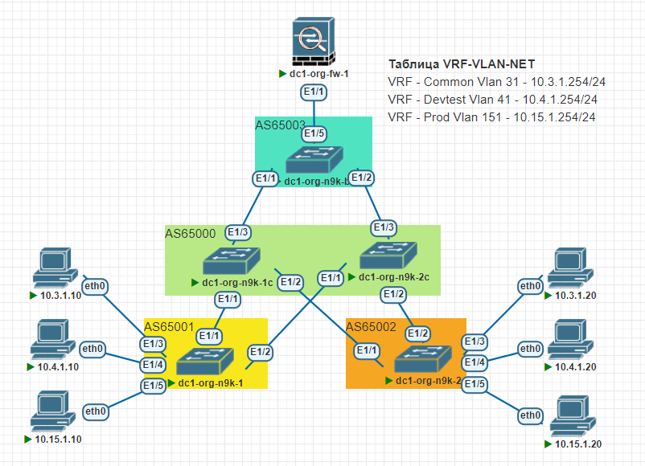

## IP optimisation

#### Цель:
Оптимизировать передачу маршрутной информации


**Описание/Пошаговая инструкция выполнения домашнего задания:**   
*Анонсируете суммарные префиксы клиентов в Overlay сеть
*Настроите маршрутизацию между клиентами через суммарный префикс
*План работы, адресное пространство, схема сети, настройки - зафиксированы в документации
	*Документация оформлена на github в файле Readme.md(markdown). Каждая лабораторная работа находится в своей директории.


**Общие характеристики сети**  
* **Топология** - Clos
* **Уровней коммутации** - 2 (Spine,Leaf)
* **Протокол** - BGP
* **Тип BGP сети** - eBGP
* **Spine AS** - одна;
* **Leaf AS** - уникальные;
* **Образ** - NxOS 9.3

**Параметры BGP** (bold means not default)
* BGP feature - *Enabled*
* Reconnect-interval *12*
* Keep alive interval - *3 seconds*
* Hold timer - *9 seconds*
* BGP PIC core - enabled
* Auto-summary - Always disabled
* Synchronization - Always disabled
* Dynamic capability - enabled
* BGP additional paths - *Enabled*
* ECMP - maximum path - 64
* bestpath - multipath-relax 


#### План настройки: 

Шаг-1 - Настройка route-map для редистрибьюции;
Шаг-2 - Включить BGP feature на устройстве;
Шаг-3 - Создать BGP инстанс (AS); 
Шаг-4 - Настройка BGP опций 
Шаг-5 - Настройка шаблонов конфигурации соседств (leaf-side);
Шаг-6 - Объявление соседей;
Шаг-7 - Проверить связность сетей.

#### План настройки VxLAN

Шаг-1 - 


**Перечень ASN для маршрутизаторов**

|Dev-Name   |AS    |RID       |#Комментарий        |
|:---------:|:----:|:--------:|--------------------|
|dc1-spine-1| 65000| 10.0.1.0 | #Lo1-Spine1        |
|dc1-spine-2| 65000| 10.0.2.0 | #Lo1-Spine2        |
|dc1-leaf-01| 65001| 10.0.1.1 | #Lo1-Leaf1         |
|dc1-leaf-02| 65002| 10.0.1.2 | #Lo1-Leaf2         |
|dc1-leaf-03| 65003| 10.0.1.3 | #Lo1-Leaf3         |
|dc1-org-fw-1| 65100| 10.3.0.1 | #Lo1-fw1        |

#### Схема:



**Адресный план:**

#### Адресация Loopback интерфейсов

|Dev-Name   |Pn   |Dn           |Sn    |Xn    |Mask|#Комментарий              |
|:---------:|:---:|:-----------:|:----:|:----:|:--:|--------------------------|
|dc1-spine-1| 10  |    0        |  1   |   0  | /32| #Loopback1-Spine1        |
|dc1-spine-2| 10  |    0        |  2   |   0  | /32| #Loopback1-Spine2        |
|dc1-spine-1| 10  |    1        |  1   |   0  | /32| #Loopback2-Spine1        |
|dc1-spine-2| 10  |    1        |  2   |   0  | /32| #Loopback2-Spine2        |
|dc1-leaf-01| 10  |    0        |  1   |   1  | /32| #Loopback1-Leaf1         |
|dc1-leaf-02| 10  |    0        |  1   |   2  | /32| #Loopback1-Leaf2         |
|dc1-leaf-03| 10  |    0        |  1   |   3  | /32| #Loopback1-Leaf3         |
|dc1-leaf-01| 10  |    1        |  2   |   1  | /32| #Loopback2-Leaf1         |
|dc1-leaf-02| 10  |    1        |  2   |   2  | /32| #Loopback2-Leaf2         |
|dc1-leaf-03| 10  |    1        |  2   |   3  | /32| #Loopback2-Leaf3         |
|dc1-leaf-03| 10  |    3        |  0   |   1  | /32| #Loopback2-Leaf3         |

#### Адресация интерфейсов PtP соединений в VRF-Default

|Dev-Name     |Pn   |Dn           |Sn    |Xn    |Mask|#Комментарий              |
|:-----------:|:---:|:-----------:|:----:|:----:|:--:|--------------------------|
|dc1-spine-1  | 10  |    2        |  1   |   0  | /31| #p2p-link-from-dc1-leaf-01-to-dc1-spine-1|
|dc1-leaf-01  | 10  |    2        |  1   |   1  | /31| #p2p-link-from-dc1-leaf-01-to-dc1-spine-1|
|dc1-spine-1  | 10  |    2        |  1   |   2  | /31| #p2p-link-from-dc1-leaf-02-to-dc1-spine-1|
|dc1-leaf-02  | 10  |    2        |  1   |   3  | /31| #p2p-link-from-dc1-leaf-02-to-dc1-spine-1|
|dc1-spine-1  | 10  |    2        |  1   |   4  | /31| #p2p-link-from-dc1-leaf-03-to-dc1-spine-1|
|dc1-leaf-03  | 10  |    2        |  1   |   5  | /31| #p2p-link-from-dc1-leaf-03-to-dc1-spine-1|
|dc1-spine-2  | 10  |    2        |  2   |   0  | /31| #p2p-link-from-dc1-leaf-01-to-dc1-spine-2|
|dc1-leaf-01  | 10  |    2        |  2   |   1  | /31| #p2p-link-from-dc1-leaf-01-to-dc1-spine-2|
|dc1-spine-2  | 10  |    2        |  2   |   2  | /31| #p2p-link-from-dc1-leaf-02-to-dc1-spine-2|
|dc1-leaf-02  | 10  |    2        |  2   |   3  | /31| #p2p-link-from-dc1-leaf-02-to-dc1-spine-2|
|dc1-spine-2  | 10  |    2        |  2   |   4  | /31| #p2p-link-from-dc1-leaf-03-to-dc1-spine-2|
|dc1-leaf-03  | 10  |    2        |  2   |   5  | /31| #p2p-link-from-dc1-leaf-03-to-dc1-spine-2|
|dc1-org-n9k-b1| 10 |    2        |  0   |   1  | /30| #VRF-Common p2p-link-from-dc1-org-n9k-b1-to-ASA     |
|dc1-org-fw-1 | 10  |    2        |  0   |   2  | /30| #VRF-Common p2p-link-from-dc1-org-n9k-b1-to-ASA     |
|dc1-org-n9k-b1| 10 |    2        |  0   |   5  | /30| #VRF-DEVTEST p2p-link-from-dc1-org-n9k-b1-to-ASA     |
|dc1-org-fw-1 | 10  |    2        |  0   |   6  | /30| #VRF-DEVTEST p2p-link-from-dc1-org-n9k-b1-to-ASA     |
|dc1-org-n9k-b1| 10 |    2        |  0   |   9  | /30| #VRF-Prod p2p-link-from-dc1-org-n9k-b1-to-ASA     |
|dc1-org-fw-1| 10  |    2        |  0   |   10  | /30| #VRF-Prod p2p-link-from-dc1-org-n9k-b1-to-ASA     |


#### Адресация для хостов
|Dev-Name   |Pn   |Dn           |Sn    |Xn    |Mask|#Комментарий              |
|:---------:|:---:|:-----------:|:----:|:----:|:--:|--------------------------|
|dc1-lf1-srv-01| 10  |    4        |  3   |   3  | /24| #ip-dc1-lf1-srv-01    |
|dc1-lf2-srv-01| 10  |    4        |  3   |   5  | /24| #ip-dc1-lf2-srv-01    |
|dc1-lf3-srv-01| 10  |    4        |  1   |   4  | /24| #ip-dc1-lf3-srv-01    |


#### Проверка работы протокола:
```
dc1-org-n9k-1# show nve peers 
dc1-org-n9k-1# 

dc1-org-n9k-1# show bgp l2vpn evpn 
BGP routing table information for VRF default, address family L2VPN EVPN
BGP table version is 195, Local Router ID is 10.0.1.1
Status: s-suppressed, x-deleted, S-stale, d-dampened, h-history, *-valid, >-best
Path type: i-internal, e-external, c-confed, l-local, a-aggregate, r-redist, I-i
njected
Origin codes: i - IGP, e - EGP, ? - incomplete, | - multipath, & - backup, 2 - b
est2

   Network            Next Hop            Metric     LocPrf     Weight Path
Route Distinguisher: 10.0.1.1:32798    (L2VNI 10031)
*>l[2]:[0]:[0]:[48]:[0050.7966.6808]:[0]:[0.0.0.0]/216
                      10.1.2.1                          100      32768 i
*>l[2]:[0]:[0]:[48]:[cee0.c2e7.4ce4]:[0]:[0.0.0.0]/216
                      10.1.2.1                          100      32768 i
*>l[2]:[0]:[0]:[48]:[0050.7966.6808]:[32]:[10.3.1.10]/272
                      10.1.2.1                          100      32768 i
*>l[3]:[0]:[32]:[10.1.2.1]/88
                      10.1.2.1                          100      32768 i

Route Distinguisher: 10.0.1.1:32808    (L2VNI 10041)
*>l[2]:[0]:[0]:[48]:[0050.7966.6809]:[0]:[0.0.0.0]/216
                      10.1.2.1                          100      32768 i
*>l[2]:[0]:[0]:[48]:[0050.7966.6809]:[32]:[10.4.1.10]/272
                      10.1.2.1                          100      32768 i
*>l[3]:[0]:[32]:[10.1.2.1]/88
                      10.1.2.1                          100      32768 i

Route Distinguisher: 10.0.1.1:32918    (L2VNI 10151)
*>l[2]:[0]:[0]:[48]:[0050.7966.680a]:[0]:[0.0.0.0]/216
                      10.1.2.1                          100      32768 i
*>l[2]:[0]:[0]:[48]:[ee31.5492.e221]:[0]:[0.0.0.0]/216
                      10.1.2.1                          100      32768 i
*>l[2]:[0]:[0]:[48]:[0050.7966.680a]:[32]:[10.15.1.10]/272
                      10.1.2.1                          100      32768 i
*>l[3]:[0]:[32]:[10.1.2.1]/88
                      10.1.2.1                          100      32768 i

Route Distinguisher: 10.0.1.2:32798
*>e[2]:[0]:[0]:[48]:[0050.7966.680b]:[0]:[0.0.0.0]/216
                      10.1.2.2                                       0 65000 650
02 i
* e                   10.1.2.2                                       0 65000 650
02 i
* e[2]:[0]:[0]:[48]:[66ae.220b.f08a]:[0]:[0.0.0.0]/216
                      10.1.2.2                                       0 65000 650
02 i
*>e                   10.1.2.2                                       0 65000 650
02 i
* e[2]:[0]:[0]:[48]:[0050.7966.680b]:[32]:[10.3.1.20]/272
                      10.1.2.2                                       0 65000 650
02 i
*>e                   10.1.2.2                                       0 65000 650
02 i
* e[3]:[0]:[32]:[10.1.2.2]/88
                      10.1.2.2                                       0 65000 650
02 i
*>e                   10.1.2.2                                       0 65000 650
02 i

Route Distinguisher: 10.0.1.2:32808
*>e[2]:[0]:[0]:[48]:[0050.7966.680c]:[0]:[0.0.0.0]/216
                      10.1.2.2                                       0 65000 650
02 i
* e                   10.1.2.2                                       0 65000 650
02 i
* e[2]:[0]:[0]:[48]:[0050.7966.680c]:[32]:[10.4.1.20]/272
                      10.1.2.2                                       0 65000 650
02 i
*>e                   10.1.2.2                                       0 65000 650
02 i
* e[3]:[0]:[32]:[10.1.2.2]/88
                      10.1.2.2                                       0 65000 650
02 i
*>e                   10.1.2.2                                       0 65000 650
02 i

Route Distinguisher: 10.0.1.2:32918
*>e[2]:[0]:[0]:[48]:[0050.7966.680d]:[0]:[0.0.0.0]/216
                      10.1.2.2                                       0 65000 650
02 i
* e                   10.1.2.2                                       0 65000 650
02 i
* e[2]:[0]:[0]:[48]:[0a36.f9a9.da4e]:[0]:[0.0.0.0]/216
                      10.1.2.2                                       0 65000 650
02 i
*>e                   10.1.2.2                                       0 65000 650
02 i
* e[2]:[0]:[0]:[48]:[0050.7966.680d]:[32]:[10.15.1.20]/272
                      10.1.2.2                                       0 65000 650
02 i
*>e                   10.1.2.2                                       0 65000 650
02 i
* e[3]:[0]:[32]:[10.1.2.2]/88
                      10.1.2.2                                       0 65000 650
02 i
*>e                   10.1.2.2                                       0 65000 650
02 i

Route Distinguisher: 10.0.1.3:32798
* e[3]:[0]:[32]:[10.1.2.3]/88
                      10.1.2.3                                       0 65000 650
03 i
*>e                   10.1.2.3                                       0 65000 650
03 i

Route Distinguisher: 10.0.1.3:32808
* e[3]:[0]:[32]:[10.1.2.3]/88
                      10.1.2.3                                       0 65000 650
03 i
*>e                   10.1.2.3                                       0 65000 650
03 i

Route Distinguisher: 10.0.1.3:32918
* e[3]:[0]:[32]:[10.1.2.3]/88
                      10.1.2.3                                       0 65000 650
03 i
*>e                   10.1.2.3                                       0 65000 650
03 i


```

Проверка маршрутной информации
```

```
###Проверка связности
```
