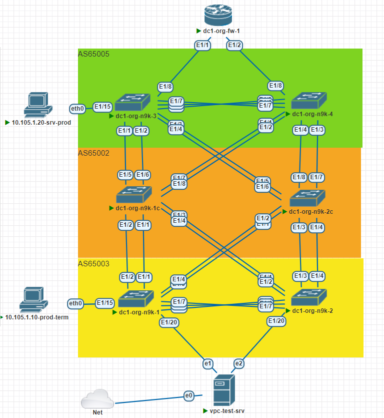
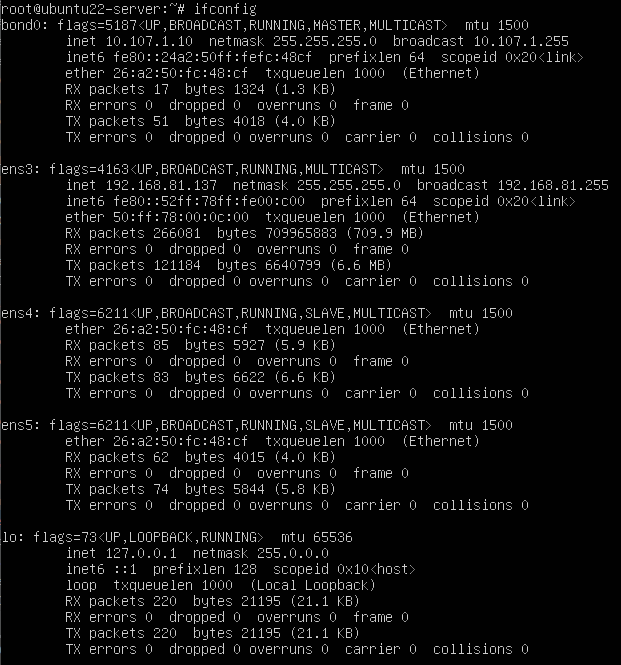
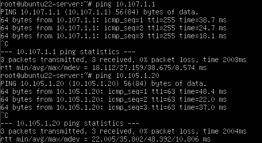

## Миграция традиционной 2-х уровневой сетевой инфраструктуры ЦОД в архитектуру Leaf-Spine c применением технологии VxLAN EVPN 

#### Цель:
Организовать L2-Транспорт для серверов с помощью технологии VxLAN L2VPN, с применением eBGP в underlay и overlay, и  VPC-конфигурацей для Leaf нод коммутаторов.

[[_TOC_]]


**Описание/Пошаговая инструкция:** 
* Настроить p2p IP связность между узлами
* Настроить VPC на Leaf узлах
* Настроить eBGP маршрутизацию между Spine и VPC-Leaf
* Настроить VxLAN домен внутри фабрики
* Подключить orphan клиентов и проверить связность
* Подключить VPC клиентов 2-я линками к различным Leaf
* Настроить агрегированный канал со стороны клиента
* План работы, адресное пространство, схема сети, настройки - зафиксированы в документации


**Общие характеристики сети**  
* **Топология** - Сеть Клоса
* **Уровней коммутации** - 2 (Spine,Leaf)
* **Протокол underlay маршрутизации** - eBGP
* **FW** - в качестве Upstream;
* **Spine AS** - одна;
* **Leaf AS** - уникальные;
* **Overlay** - BGP L2VPN;
* **VxLAN-cfg** - *На всех нодах*;
* **Образ** - NxOS 9.3

**Параметры BGP** (bold means not default)
* BGP feature - *Enabled*
* Reconnect-interval *12*
* Keep alive interval - *3 seconds*
* Hold timer - *9 seconds*
* BGP PIC core - enabled
* Auto-summary - Always disabled
* Synchronization - Always disabled
* Dynamic capability - enabled
* BGP additional paths - *Enabled*
* ECMP - maximum path - 64
* bestpath - multipath-relax 

**Параметры VxLAN**
* Модель сервиса - VLAN based (EVPN-L2)
* VRF - default
* update-source - loopback2
* ebgp-multihop - 3
* RD - Ручная настройка
* RT - Ручная настройка
* BUM - ingress replication bgp

**Параметры VPC**
* VPC- 2 пары
* peer-switch - enabled
* peer-keepalive - vrf-management
* peer-gateway - enabled
* auto-recovery - enabled
* ip arp synchronize - enabled
* layer3 peer-router - enabled
* delay restore - 240
* delay restore interface-vlan - 80
* Peer-link - physical link
* Peer-KA - direct physical link


#### План настройки VPC:

+ Шаг-1 - Включить feature lacp+vpc для коммутаторов
+ Шаг-2 - Настройка VPC-Domain и приоритетов для коммутаторов
+ Шаг-3 - Настройка secondary IP для VxLAN loopback1
+ Шаг-4 - Настройка VPC-link в сторону серверов
+ Шаг-5 - Проверка работы.


#### План настройки eBGP: 

+ Шаг-1 - Настройка route-map для редистрибьюции;
+ Шаг-2 - Включить BGP feature на устройстве;
+ Шаг-3 - Создать BGP инстанс (AS); 
+ Шаг-4 - Настройка BGP опций 
+ Шаг-5 - Настройка конфигурации соседств;
+ Шаг-6 - Объявление соседей;
+ Шаг-7 - Проверить связность сетей.


#### План настройки vXLAN:
+ Шаг-1 - Включить evpn-feature на коммутаторах;
+ Шаг-2 - Настройка VLAN и vn-segment;
+ Шаг-3 - Настройка VNI;
+ Шаг-4 - Настройка RD и RT
+ Шаг-5 - Настройка NVE на Lo2 и указание участников  
+ Шаг-6 - Настройка BGP на VTEP
+ Шаг-8 - Проверка работы VxLAN


**Параметры VPC для коммутаторов**
|Dev-Name   |VPC-D |Role-pri  |
|:---------:|:----:|:--------:|
|dc1-leaf-01|10    |100 | 
|dc1-leaf-02|10    |200 | 
|dc1-leaf-03|30    |100 | 
|dc1-leaf-04|30    |200 | 

Дополнения к конфигурации VPC, для корректной работы:

Добавить в конфигурацию для VPC:

Согласно рекомендациям Cisco, для VPC увеличить таймеры, для нивелирования проблем с ложно-положительной генерацией TCN
```
	switch(config)# spanning-tree vlan 1-3967 hello-time 4
	switch(config)# spanning-tree vlan 1-3967 forward-time 30
	switch(config)# spanning-tree vlan 1-3967 max-age 40
```
Распределить tcam для arp-supression
```
	hardware access-list tcam region racl 512
	hardware access-list tcam region arp-ether 256 double-wide
```

Увеличить MTU до 9216
```
    If the fabric only contains Cisco Nexus 9000 and 7000 series switches, then the
    MTU should be set to 9216.
```

Убрать проверку peer-as-check для распространения маршрутов между нодами
```
	neighbor 10.0.1.2 remote-as 65551
	address-family ipv4 unicast
	disable-peer-as-check
	send-community both


```


**Перечень ASN для маршрутизаторов**

|Dev-Name   |AS    |   RID    | #Комментарий |
|:---------:|:----:|:--------:|--------------|
|dc1-org-n9k1c| 65002| 10.101.1.0 | #Lo1-Spine1  |
|dc1-org-n9k2c| 65002| 10.101.2.0 | #Lo1-Spine2  |
|dc1-org-n9k-1| 65003| 10.101.0.1 | #Lo1-Leaf1   |
|dc1-org-n9k-2| 65003| 10.101.0.2 | #Lo1-Leaf2   |
|dc1-org-n9k-3| 65005| 10.101.0.3 | #Lo1-Leaf3   |
|dc1-org-n9k-4| 65005| 10.101.0.4 | #Lo1-Leaf4   |


#### Схема




**Адресный план:**

#### Адресация для хостов

|Dev-Name   |Pn   |Dn           |Sn    |Xn    |Mask|#Комментарий              |
|:---------:|:---:|:-----------:|:----:|:----:|:--:|--------------------------|
|prod-term  | 10  |    105        |  1   |   10  | /24 | #prod-proj1    |
|srv-prod   | 10  |    105        |  1   |   20  | /24 | #prod-proj1    |
|vpc-test-srv| 10  |    107        |  1   |   10  | /24 | #dev-prog1    |

#### Адресация Loopback интерфейсов

|leafname	|ip-address	| mask |	Description|
|:---------:|:-----------:|:---:|:-----------:|
|dc1-org-n9k1	|10.101.0.1	|/32	|lo1|
|dc1-org-n9k1	|10.102.0.1	|/32	|lo2|
|dc1-org-n9k2	|10.101.0.2	|/32	|lo1|
|dc1-org-n9k2	|10.102.0.2	|/32	|lo2|
|dc1-org-n9k3	|10.101.0.3	|/32	|lo1|
|dc1-org-n9k3	|10.102.0.3	|/32	|lo2|
|dc1-org-n9k4	|10.101.0.4	|/32	|lo1|
|dc1-org-n9k4	|10.102.0.4	|/32	|lo2|
|dc1-org-n9k5	|10.101.0.5	|/32	|lo1|
|dc1-org-n9k5	|10.102.0.5	|/32	|lo2|
|dc1-org-n9k1c	|10.101.1.0	|/32	|lo1|
|dc1-org-n9k1c	|10.102.1.0	|/32	|lo2|
|dc1-org-n9k2c	|10.101.2.0	|/32	|lo1|
|dc1-org-n9k2c	|10.102.2.0	|/32	|lo2|

#### Адресация p2p интерфейсов
|leafname	|ip-address	| mask |	Description|
|:---------:|:-----------:|:---:|:-----------:|
|dc1-org-n9k1	|10.103.1.1	|/31	|p2p-leaf1-sp1|
|dc1-org-n9k1	|10.103.2.1	|/31	|p2p-leaf1-sp2|
|dc1-org-n9k2	|10.103.1.3	|/31	|p2p-leaf2-sp1|
|dc1-org-n9k2	|10.103.2.3	|/31	|p2p-leaf2-sp2|
|dc1-org-n9k3	|10.103.1.5	|/31	|p2p-leaf3-sp1|
|dc1-org-n9k3	|10.103.2.5	|/31	|p2p-leaf3-sp2|
|dc1-org-n9k4	|10.103.1.7	|/31	|p2p-leaf4-sp1|
|dc1-org-n9k4	|10.103.2.7	|/31	|p2p-leaf4-sp2|
|dc1-org-n9k5	|10.103.1.9	|/31	|p2p-leaf5-sp1|
|dc1-org-n9k5	|10.103.2.9	|/31	|p2p-leaf5-sp2|
|dc1-org-n9k-s1	|10.103.1.0	|/31	|p2p-leaf1-sp1|
|dc1-org-n9k-s2	|10.103.2.0	|/31	|p2p-leaf1-sp2|
|dc1-org-n9k-s1	|10.103.1.2	|/31	|p2p-leaf2-sp1|
|dc1-org-n9k-s2	|10.103.2.2	|/31	|p2p-leaf2-sp2|
|dc1-org-n9k-s1	|10.103.1.4	|/31	|p2p-leaf3-sp1|
|dc1-org-n9k-s2	|10.103.2.4	|/31	|p2p-leaf3-sp2|
|dc1-org-n9k-s1	|10.103.1.6	|/31	|p2p-leaf4-sp1|
|dc1-org-n9k-s2	|10.103.2.6	|/31	|p2p-leaf4-sp2|
|dc1-org-n9k-s1	|10.103.1.8	|/31	|p2p-leaf5-sp1|
|dc1-org-n9k-s2	|10.103.2.8	|/31	|p2p-leaf5-sp2|


#### Проверка работы VPC:

*Вывод информации о VPC*

```
dc1-org-n9k-1# show vpc 
Legend:
                (*) - local vPC is down, forwarding via vPC peer-link

vPC domain id                     : 10  
Peer status                       : peer adjacency formed ok      
vPC keep-alive status             : peer is alive                 
Configuration consistency status  : success 
Per-vlan consistency status       : success                       
Type-2 consistency status         : success 
vPC role                          : primary                       
Number of vPCs configured         : 1   
Peer Gateway                      : Enabled
Dual-active excluded VLANs        : -
Graceful Consistency Check        : Enabled
Auto-recovery status              : Enabled, timer is off.(timeout = 240s)
Delay-restore status              : Timer is off.(timeout = 240s)
Delay-restore SVI status          : Timer is off.(timeout = 80s)
Operational Layer3 Peer-router    : Enabled
Virtual-peerlink mode             : Disabled

vPC Peer-link status
---------------------------------------------------------------------
id    Port   Status Active vlans    
--    ----   ------ -------------------------------------------------
1     Po1000 up     1,777,3000-3008                                                      

vPC status
----------------------------------------------------------------------------
Id    Port          Status Consistency Reason                Active vlans
--    ------------  ------ ----------- ------                ---------------
120   Po120         up     success     success               3006                        
                                                                                         

Please check "show vpc consistency-parameters vpc <vpc-num>" for the 
consistency reason of down vpc and for type-2 consistency reasons for 
any vpc.

----------------------------------------------------------------------------------------------

dc1-org-n9k-3# show vpc 
Legend:
                (*) - local vPC is down, forwarding via vPC peer-link

vPC domain id                     : 30  
Peer status                       : peer adjacency formed ok      
vPC keep-alive status             : peer is alive                 
Configuration consistency status  : success 
Per-vlan consistency status       : success                       
Type-2 consistency status         : success 
vPC role                          : secondary                     
Number of vPCs configured         : 1   
Peer Gateway                      : Enabled
Dual-active excluded VLANs        : -
Graceful Consistency Check        : Enabled
Auto-recovery status              : Enabled, timer is off.(timeout = 240s)
Delay-restore status              : Timer is off.(timeout = 240s)
Delay-restore SVI status          : Timer is off.(timeout = 80s)
Operational Layer3 Peer-router    : Enabled
Virtual-peerlink mode             : Disabled

vPC Peer-link status
---------------------------------------------------------------------
id    Port   Status Active vlans    
--    ----   ------ -------------------------------------------------
1     Po1000 up     1,88,777,3000-3008                                                   

vPC status
----------------------------------------------------------------------------
Id    Port          Status Consistency Reason                Active vlans
--    ------------  ------ ----------- ------                ---------------
88    Po88          up     success     success               3000-3008                   
                                                                                         

Please check "show vpc consistency-parameters vpc <vpc-num>" for the 
consistency reason of down vpc and for type-2 consistency reasons for 
any vpc.

```

## Проверка работы L2VPN

Скриншот с Ubuntu образа с настроенным bonding до VPC пары n9k-1-2



Тест доступности узлов PROD с DEV сервера через FW



Проверка связности между узлами PROD в L2VPN и доступ к DEV через FW
```
VPCS> show

NAME   IP/MASK              GATEWAY                             GATEWAY
VPCS1  10.105.1.10/24       10.105.1.1
       fe80::250:79ff:fe66:6808/64

VPCS> ping 10.105.1.1

84 bytes from 10.105.1.1 icmp_seq=1 ttl=255 time=54.094 ms
^C
VPCS> ping 10.105.1.20

84 bytes from 10.105.1.20 icmp_seq=1 ttl=64 time=33.476 ms
^C
VPCS> ping 10.107.1.10

84 bytes from 10.107.1.10 icmp_seq=1 ttl=63 time=38.840 ms
^C
VPCS> 

```

## Проверка работы маршрутизации**

Команды проверки изучения маршрутов L2VNI
```
dc1-org-n9k-1# show ip route 
IP Route Table for VRF "default"
'*' denotes best ucast next-hop
'**' denotes best mcast next-hop
'[x/y]' denotes [preference/metric]
'%<string>' in via output denotes VRF <string>

10.101.0.1/32, ubest/mbest: 2/0, attached
    *via 10.101.0.1, Lo1, [0/0], 21:02:39, local
    *via 10.101.0.1, Lo1, [0/0], 21:02:39, direct
10.101.0.3/32, ubest/mbest: 2/0
    *via 10.103.1.0, [20/0], 20:13:17, bgp-65003, external, tag 65002
    *via 10.103.2.0, [20/0], 20:12:47, bgp-65003, external, tag 65002
10.101.0.4/32, ubest/mbest: 2/0
    *via 10.103.1.0, [20/0], 20:12:54, bgp-65003, external, tag 65002
    *via 10.103.2.0, [20/0], 20:12:58, bgp-65003, external, tag 65002
10.101.1.0/32, ubest/mbest: 1/0
    *via 10.103.1.0, [20/0], 20:18:31, bgp-65003, external, tag 65002
10.101.2.0/32, ubest/mbest: 1/0
    *via 10.103.2.0, [20/0], 20:18:16, bgp-65003, external, tag 65002
10.101.200.1/32, ubest/mbest: 2/0, attached
    *via 10.101.200.1, Lo1, [0/0], 04:57:00, local
    *via 10.101.200.1, Lo1, [0/0], 04:57:00, direct
10.101.200.3/32, ubest/mbest: 2/0
    *via 10.103.1.0, [20/0], 04:41:19, bgp-65003, external, tag 65002
    *via 10.103.2.0, [20/0], 04:41:19, bgp-65003, external, tag 65002
10.102.0.1/32, ubest/mbest: 2/0, attached
    *via 10.102.0.1, Lo2, [0/0], 04:55:53, local
    *via 10.102.0.1, Lo2, [0/0], 04:55:53, direct
10.102.0.3/32, ubest/mbest: 2/0
    *via 10.103.1.0, [20/0], 04:40:06, bgp-65003, external, tag 65002
    *via 10.103.2.0, [20/0], 04:40:06, bgp-65003, external, tag 65002
10.102.0.4/32, ubest/mbest: 2/0
    *via 10.103.1.0, [20/0], 20:12:54, bgp-65003, external, tag 65002
    *via 10.103.2.0, [20/0], 20:12:58, bgp-65003, external, tag 65002
10.102.1.0/32, ubest/mbest: 1/0
    *via 10.103.1.0, [20/0], 20:18:31, bgp-65003, external, tag 65002
10.102.2.0/32, ubest/mbest: 1/0
    *via 10.103.2.0, [20/0], 20:18:16, bgp-65003, external, tag 65002
10.102.200.1/32, ubest/mbest: 2/0, attached
    *via 10.102.200.1, Lo2, [0/0], 04:55:47, local
    *via 10.102.200.1, Lo2, [0/0], 04:55:47, direct
10.102.200.3/32, ubest/mbest: 2/0
    *via 10.103.1.0, [20/0], 04:40:16, bgp-65003, external, tag 65002
    *via 10.103.2.0, [20/0], 04:40:16, bgp-65003, external, tag 65002
10.103.1.0/31, ubest/mbest: 1/0, attached
    *via 10.103.1.1, Po21, [0/0], 20:28:50, direct
10.103.1.1/32, ubest/mbest: 1/0, attached
    *via 10.103.1.1, Po21, [0/0], 20:28:50, local
10.103.2.0/31, ubest/mbest: 1/0, attached
    *via 10.103.2.1, Po43, [0/0], 21:13:03, direct
10.103.2.1/32, ubest/mbest: 1/0, attached
    *via 10.103.2.1, Po43, [0/0], 21:13:03, local
10.105.1.0/24, ubest/mbest: 1/0, attached
    *via 10.105.1.254, Vlan3000, [0/0], 04:59:47, direct
10.105.1.10/32, ubest/mbest: 1/0, attached
    *via 10.105.1.10, Vlan3000, [190/0], 04:35:24, hmm
10.105.1.254/32, ubest/mbest: 1/0, attached
    *via 10.105.1.254, Vlan3000, [0/0], 04:59:47, local
10.105.2.0/24, ubest/mbest: 1/0, attached
    *via 10.105.2.254, Vlan3001, [0/0], 04:59:46, direct
10.105.2.254/32, ubest/mbest: 1/0, attached
    *via 10.105.2.254, Vlan3001, [0/0], 04:59:46, local
10.105.3.0/24, ubest/mbest: 1/0, attached
    *via 10.105.3.254, Vlan3002, [0/0], 04:59:46, direct
10.105.3.254/32, ubest/mbest: 1/0, attached
    *via 10.105.3.254, Vlan3002, [0/0], 04:59:46, local
10.106.1.0/24, ubest/mbest: 1/0, attached
    *via 10.106.1.254, Vlan3003, [0/0], 04:59:46, direct
10.106.1.254/32, ubest/mbest: 1/0, attached
    *via 10.106.1.254, Vlan3003, [0/0], 04:59:46, local
10.106.2.0/24, ubest/mbest: 1/0, attached
    *via 10.106.2.254, Vlan3004, [0/0], 04:59:45, direct
10.106.2.254/32, ubest/mbest: 1/0, attached
    *via 10.106.2.254, Vlan3004, [0/0], 04:59:45, local
10.106.3.0/24, ubest/mbest: 1/0, attached
    *via 10.106.3.254, Vlan3005, [0/0], 04:59:45, direct
10.106.3.254/32, ubest/mbest: 1/0, attached
    *via 10.106.3.254, Vlan3005, [0/0], 04:59:45, local
10.107.1.0/24, ubest/mbest: 1/0, attached
    *via 10.107.1.254, Vlan3006, [0/0], 04:59:45, direct
10.107.1.10/32, ubest/mbest: 1/0, attached
    *via 10.107.1.10, Vlan3006, [190/0], 02:36:26, hmm
10.107.1.254/32, ubest/mbest: 1/0, attached
    *via 10.107.1.254, Vlan3006, [0/0], 04:59:45, local
10.107.2.0/24, ubest/mbest: 1/0, attached
    *via 10.107.2.254, Vlan3007, [0/0], 04:52:48, direct
10.107.2.254/32, ubest/mbest: 1/0, attached
    *via 10.107.2.254, Vlan3007, [0/0], 04:52:48, local
10.107.3.0/24, ubest/mbest: 1/0, attached
    *via 10.107.3.254, Vlan3008, [0/0], 04:49:24, direct
10.107.3.254/32, ubest/mbest: 1/0, attached
    *via 10.107.3.254, Vlan3008, [0/0], 04:49:24, local

dc1-org-n9k-1# show bgp l2vpn evpn 
BGP routing table information for VRF default, address family L2VPN EVPN
BGP table version is 418, Local Router ID is 10.101.0.1
Status: s-suppressed, x-deleted, S-stale, d-dampened, h-history, *-valid, >-best
Path type: i-internal, e-external, c-confed, l-local, a-aggregate, r-redist, I-injected
Origin codes: i - IGP, e - EGP, ? - incomplete, | - multipath, & - backup, 2 - best2

   Network            Next Hop            Metric     LocPrf     Weight Path
Route Distinguisher: 10.102.0.1:3000    (L2VNI 13000)
*>l[2]:[0]:[0]:[48]:[0050.7966.6808]:[0]:[0.0.0.0]/216
                      10.102.200.1                      100      32768 i
*>e[2]:[0]:[0]:[48]:[0050.7966.680b]:[0]:[0.0.0.0]/216
                      10.102.200.3                                   0 65002 65005 i
* e                   10.102.200.3                                   0 65002 65005 i
* e[2]:[0]:[0]:[48]:[5000.0a00.1b08]:[0]:[0.0.0.0]/216
                      10.102.200.3                                   0 65002 65005 i
*>e                   10.102.200.3                                   0 65002 65005 i
*>l[2]:[0]:[0]:[48]:[569b.a9f1.0d46]:[0]:[0.0.0.0]/216
                      10.102.200.1                      100      32768 i
* e[2]:[0]:[0]:[48]:[a2ca.ea20.1465]:[0]:[0.0.0.0]/216
                      10.102.200.3                                   0 65002 65005 i
*>e                   10.102.200.3                                   0 65002 65005 i
*>l[2]:[0]:[0]:[48]:[0050.7966.6808]:[32]:[10.105.1.10]/248
                      10.102.200.1                      100      32768 i
* e[2]:[0]:[0]:[48]:[0050.7966.680b]:[32]:[10.105.1.20]/248
                      10.102.200.3                                   0 65002 65005 i
*>e                   10.102.200.3                                   0 65002 65005 i
* e[2]:[0]:[0]:[48]:[5000.0a00.1b08]:[32]:[10.105.1.1]/248
                      10.102.200.3                                   0 65002 65005 i
*>e                   10.102.200.3                                   0 65002 65005 i
*>l[3]:[0]:[32]:[10.102.200.1]/88
                      10.102.200.1                      100      32768 i
* e[3]:[0]:[32]:[10.102.200.3]/88
                      10.102.200.3                                   0 65002 65005 i
*>e                   10.102.200.3                                   0 65002 65005 i

Route Distinguisher: 10.102.0.1:3001    (L2VNI 13001)
*>l[3]:[0]:[32]:[10.102.200.1]/88
                      10.102.200.1                      100      32768 i
* e[3]:[0]:[32]:[10.102.200.3]/88
                      10.102.200.3                                   0 65002 65005 i
*>e                   10.102.200.3                                   0 65002 65005 i

Route Distinguisher: 10.102.0.1:3002    (L2VNI 13002)
*>l[3]:[0]:[32]:[10.102.200.1]/88
                      10.102.200.1                      100      32768 i
* e[3]:[0]:[32]:[10.102.200.3]/88
                      10.102.200.3                                   0 65002 65005 i
*>e                   10.102.200.3                                   0 65002 65005 i

Route Distinguisher: 10.102.0.1:3003    (L2VNI 13003)
*>l[3]:[0]:[32]:[10.102.200.1]/88
                      10.102.200.1                      100      32768 i
* e[3]:[0]:[32]:[10.102.200.3]/88
                      10.102.200.3                                   0 65002 65005 i
*>e                   10.102.200.3                                   0 65002 65005 i

Route Distinguisher: 10.102.0.1:3004    (L2VNI 13004)
*>l[3]:[0]:[32]:[10.102.200.1]/88
                      10.102.200.1                      100      32768 i
* e[3]:[0]:[32]:[10.102.200.3]/88
                      10.102.200.3                                   0 65002 65005 i
*>e                   10.102.200.3                                   0 65002 65005 i

Route Distinguisher: 10.102.0.1:3005    (L2VNI 13005)
*>l[3]:[0]:[32]:[10.102.200.1]/88
                      10.102.200.1                      100      32768 i
* e[3]:[0]:[32]:[10.102.200.3]/88
                      10.102.200.3                                   0 65002 65005 i
*>e                   10.102.200.3                                   0 65002 65005 i

Route Distinguisher: 10.102.0.1:3006    (L2VNI 13006)
*>l[2]:[0]:[0]:[48]:[1a09.8cc1.bab9]:[0]:[0.0.0.0]/216
                      10.102.200.1                      100      32768 i
*>l[2]:[0]:[0]:[48]:[26a2.50fc.48cf]:[0]:[0.0.0.0]/216
                      10.102.200.1                      100      32768 i
*>l[2]:[0]:[0]:[48]:[4e03.2ae0.7182]:[0]:[0.0.0.0]/216
                      10.102.200.1                      100      32768 i
* e[2]:[0]:[0]:[48]:[5000.0a00.1b08]:[0]:[0.0.0.0]/216
                      10.102.200.3                                   0 65002 65005 i
*>e                   10.102.200.3                                   0 65002 65005 i
*>l[2]:[0]:[0]:[48]:[26a2.50fc.48cf]:[32]:[10.107.1.10]/248
                      10.102.200.1                      100      32768 i
* e[2]:[0]:[0]:[48]:[5000.0a00.1b08]:[32]:[10.107.1.1]/248
                      10.102.200.3                                   0 65002 65005 i
*>e                   10.102.200.3                                   0 65002 65005 i
*>l[3]:[0]:[32]:[10.102.200.1]/88
                      10.102.200.1                      100      32768 i
* e[3]:[0]:[32]:[10.102.200.3]/88
                      10.102.200.3                                   0 65002 65005 i
*>e                   10.102.200.3                                   0 65002 65005 i

Route Distinguisher: 10.102.0.1:3007    (L2VNI 13007)
*>l[3]:[0]:[32]:[10.102.200.1]/88
                      10.102.200.1                      100      32768 i
* e[3]:[0]:[32]:[10.102.200.3]/88
                      10.102.200.3                                   0 65002 65005 i
*>e                   10.102.200.3                                   0 65002 65005 i

Route Distinguisher: 10.102.0.1:3008    (L2VNI 13008)
*>l[3]:[0]:[32]:[10.102.200.1]/88
                      10.102.200.1                      100      32768 i
* e[3]:[0]:[32]:[10.102.200.3]/88
                      10.102.200.3                                   0 65002 65005 i
*>e                   10.102.200.3                                   0 65002 65005 i

Route Distinguisher: 10.102.0.3:3000
*>e[2]:[0]:[0]:[48]:[0050.7966.680b]:[0]:[0.0.0.0]/216
                      10.102.200.3                                   0 65002 65005 i
* e                   10.102.200.3                                   0 65002 65005 i
* e[2]:[0]:[0]:[48]:[5000.0a00.1b08]:[0]:[0.0.0.0]/216
                      10.102.200.3                                   0 65002 65005 i
*>e                   10.102.200.3                                   0 65002 65005 i
* e[2]:[0]:[0]:[48]:[a2ca.ea20.1465]:[0]:[0.0.0.0]/216
                      10.102.200.3                                   0 65002 65005 i
*>e                   10.102.200.3                                   0 65002 65005 i
* e[2]:[0]:[0]:[48]:[0050.7966.680b]:[32]:[10.105.1.20]/248
                      10.102.200.3                                   0 65002 65005 i
*>e                   10.102.200.3                                   0 65002 65005 i
* e[2]:[0]:[0]:[48]:[5000.0a00.1b08]:[32]:[10.105.1.1]/248
                      10.102.200.3                                   0 65002 65005 i
*>e                   10.102.200.3                                   0 65002 65005 i
* e[3]:[0]:[32]:[10.102.200.3]/88
                      10.102.200.3                                   0 65002 65005 i
*>e                   10.102.200.3                                   0 65002 65005 i

Route Distinguisher: 10.102.0.3:3001
* e[3]:[0]:[32]:[10.102.200.3]/88
                      10.102.200.3                                   0 65002 65005 i
*>e                   10.102.200.3                                   0 65002 65005 i

Route Distinguisher: 10.102.0.3:3002
* e[3]:[0]:[32]:[10.102.200.3]/88
                      10.102.200.3                                   0 65002 65005 i
*>e                   10.102.200.3                                   0 65002 65005 i

Route Distinguisher: 10.102.0.3:3003
* e[3]:[0]:[32]:[10.102.200.3]/88
                      10.102.200.3                                   0 65002 65005 i
*>e                   10.102.200.3                                   0 65002 65005 i

Route Distinguisher: 10.102.0.3:3004
* e[3]:[0]:[32]:[10.102.200.3]/88
                      10.102.200.3                                   0 65002 65005 i
*>e                   10.102.200.3                                   0 65002 65005 i

Route Distinguisher: 10.102.0.3:3005
* e[3]:[0]:[32]:[10.102.200.3]/88
                      10.102.200.3                                   0 65002 65005 i
*>e                   10.102.200.3                                   0 65002 65005 i

Route Distinguisher: 10.102.0.3:3006
* e[2]:[0]:[0]:[48]:[5000.0a00.1b08]:[0]:[0.0.0.0]/216
                      10.102.200.3                                   0 65002 65005 i
*>e                   10.102.200.3                                   0 65002 65005 i
* e[2]:[0]:[0]:[48]:[5000.0a00.1b08]:[32]:[10.107.1.1]/248
                      10.102.200.3                                   0 65002 65005 i
*>e                   10.102.200.3                                   0 65002 65005 i
* e[3]:[0]:[32]:[10.102.200.3]/88
                      10.102.200.3                                   0 65002 65005 i
*>e                   10.102.200.3                                   0 65002 65005 i

Route Distinguisher: 10.102.0.3:3007
* e[3]:[0]:[32]:[10.102.200.3]/88
                      10.102.200.3                                   0 65002 65005 i
*>e                   10.102.200.3                                   0 65002 65005 i

Route Distinguisher: 10.102.0.3:3008
* e[3]:[0]:[32]:[10.102.200.3]/88
                      10.102.200.3                                   0 65002 65005 i
*>e                   10.102.200.3                                   0 65002 65005 i

Route Distinguisher: 10.102.0.4:3000
* e[2]:[0]:[0]:[48]:[0050.7966.680b]:[0]:[0.0.0.0]/216
                      10.102.200.3                                   0 65002 65005 i
*>e                   10.102.200.3                                   0 65002 65005 i
* e[2]:[0]:[0]:[48]:[5000.0a00.1b08]:[0]:[0.0.0.0]/216
                      10.102.200.3                                   0 65002 65005 i
*>e                   10.102.200.3                                   0 65002 65005 i
* e[2]:[0]:[0]:[48]:[a2ca.ea20.1465]:[0]:[0.0.0.0]/216
                      10.102.200.3                                   0 65002 65005 i
*>e                   10.102.200.3                                   0 65002 65005 i
* e[2]:[0]:[0]:[48]:[0050.7966.680b]:[32]:[10.105.1.20]/248
                      10.102.200.3                                   0 65002 65005 i
*>e                   10.102.200.3                                   0 65002 65005 i
* e[2]:[0]:[0]:[48]:[5000.0a00.1b08]:[32]:[10.105.1.1]/248
                      10.102.200.3                                   0 65002 65005 i
*>e                   10.102.200.3                                   0 65002 65005 i
* e[3]:[0]:[32]:[10.102.200.3]/88
                      10.102.200.3                                   0 65002 65005 i
*>e                   10.102.200.3                                   0 65002 65005 i

Route Distinguisher: 10.102.0.4:3001
* e[3]:[0]:[32]:[10.102.200.3]/88
                      10.102.200.3                                   0 65002 65005 i
*>e                   10.102.200.3                                   0 65002 65005 i

Route Distinguisher: 10.102.0.4:3002
* e[3]:[0]:[32]:[10.102.200.3]/88
                      10.102.200.3                                   0 65002 65005 i
*>e                   10.102.200.3                                   0 65002 65005 i

Route Distinguisher: 10.102.0.4:3003
* e[3]:[0]:[32]:[10.102.200.3]/88
                      10.102.200.3                                   0 65002 65005 i
*>e                   10.102.200.3                                   0 65002 65005 i

Route Distinguisher: 10.102.0.4:3004
* e[3]:[0]:[32]:[10.102.200.3]/88
                      10.102.200.3                                   0 65002 65005 i
*>e                   10.102.200.3                                   0 65002 65005 i

Route Distinguisher: 10.102.0.4:3005
* e[3]:[0]:[32]:[10.102.200.3]/88
                      10.102.200.3                                   0 65002 65005 i
*>e                   10.102.200.3                                   0 65002 65005 i

Route Distinguisher: 10.102.0.4:3006
* e[2]:[0]:[0]:[48]:[5000.0a00.1b08]:[0]:[0.0.0.0]/216
                      10.102.200.3                                   0 65002 65005 i
*>e                   10.102.200.3                                   0 65002 65005 i
* e[2]:[0]:[0]:[48]:[5000.0a00.1b08]:[32]:[10.107.1.1]/248
                      10.102.200.3                                   0 65002 65005 i
*>e                   10.102.200.3                                   0 65002 65005 i
* e[3]:[0]:[32]:[10.102.200.3]/88
                      10.102.200.3                                   0 65002 65005 i
*>e                   10.102.200.3                                   0 65002 65005 i

Route Distinguisher: 10.102.0.4:3007
* e[3]:[0]:[32]:[10.102.200.3]/88
                      10.102.200.3                                   0 65002 65005 i
*>e                   10.102.200.3                                   0 65002 65005 i

Route Distinguisher: 10.102.0.4:3008
* e[3]:[0]:[32]:[10.102.200.3]/88
                      10.102.200.3                                   0 65002 65005 i
*>e                   10.102.200.3                                   0 65002 65005 i

```

### Проверка связности BGP
```
dc1-org-n9k-1c# show ip bgp summary 
BGP summary information for VRF default, address family IPv4 Unicast
BGP router identifier 10.101.2.0, local AS number 65002
BGP table version is 44, IPv4 Unicast config peers 4, capable peers 4
14 network entries and 18 paths using 3896 bytes of memory
BGP attribute entries [3/516], BGP AS path entries [2/12]
BGP community entries [0/0], BGP clusterlist entries [0/0]

Neighbor        V    AS MsgRcvd MsgSent   TblVer  InQ OutQ Up/Down  State/PfxRcd
10.103.1.1      4 65003   24373   24366       44    0    0 20:20:37 4         
10.103.1.3      4 65003   24336   24328       44    0    0 20:16:02 4         
10.103.1.5      4 65005   24269   24264       44    0    0 20:15:23 4         
10.103.1.7      4 65005   24261   24255       44    0    0 20:15:00 4         
dc1-org-n9k-1c# show bgp l2vpn evpn summary 
BGP summary information for VRF default, address family L2VPN EVPN
BGP router identifier 10.101.2.0, local AS number 65002
BGP table version is 335, L2VPN EVPN config peers 4, capable peers 4
64 network entries and 64 paths using 15616 bytes of memory
BGP attribute entries [22/3784], BGP AS path entries [2/12]
BGP community entries [0/0], BGP clusterlist entries [0/0]

Neighbor        V    AS MsgRcvd MsgSent   TblVer  InQ OutQ Up/Down  State/PfxRcd
10.102.0.1      4 65003     475     395      335    0    0 06:05:32 16        
10.102.0.2      4 65003     449     392      335    0    0 04:57:27 16        
10.102.0.3      4 65005     440     397      335    0    0 04:42:07 16        
10.102.0.4      4 65005     489     401      335    0    0 06:02:59 16        
dc1-org-n9k-1c# 
```
### Проверка L2RIB
```
dc1-org-n9k-1# show l2rib registrations 
Client ID   Topology ID   Object Type   Producer    
---------   -----------   -----------   ------------
0           ALL           MAC           Multiple    
0           ALL           Topology( 1)   VXLAN       
0           ALL           EVPN_PL       UFDM        
1           ALL           EVPN_PL       None        
1           ALL           VXLAN_FL      VXLAN       
2           ALL           CMCAST_ROUTE   NGMVPN      
3           ALL           Topology( 1)   VXLAN       
3           ALL           ARP_SIGNAL    None        
3           3000          MAC-IP        BGP         
3           3001          MAC-IP        BGP         
3           3002          MAC-IP        BGP         
3           3003          MAC-IP        BGP         
3           3004          MAC-IP        BGP         
3           3005          MAC-IP        BGP         
3           3006          MAC-IP        BGP         
3           3007          MAC-IP        BGP         
3           3008          MAC-IP        BGP         
4           ALL           Topology( 9)   VXLAN       
5           3000          IMET_ROUTE    BGP         
5           3001          IMET_ROUTE    BGP         
5           3002          IMET_ROUTE    BGP         
5           3003          IMET_ROUTE    BGP         
5           3004          IMET_ROUTE    BGP         
5           3005          IMET_ROUTE    BGP         
5           3006          IMET_ROUTE    BGP         
5           3007          IMET_ROUTE    BGP         
5           3008          IMET_ROUTE    BGP         
5           GLOBAL        ES_ENTRY      BGP         
5           GLOBAL        ES_ACK        BGP         
6           3000          MAC           Best Route  
6           3001          MAC           Best Route  
6           3002          MAC           Best Route  
6           3003          MAC           Best Route  
6           3004          MAC           Best Route  
6           3005          MAC           Best Route  
6           3006          MAC           Best Route  
6           3007          MAC           Best Route  
6           3008          MAC           Best Route  
6           ALL           Topology(6169)   VXLAN       
6           3000          EAD           VXLAN       
6           3001          EAD           VXLAN       
6           3002          EAD           VXLAN       
6           3003          EAD           VXLAN       
6           3004          EAD           VXLAN       
6           3005          EAD           VXLAN       
6           3006          EAD           VXLAN       
6           3007          EAD           VXLAN       
6           3008          EAD           VXLAN       
6           GLOBAL        EAD           VXLAN       
6           3000          IMET_ROUTE    VXLAN       
6           3001          IMET_ROUTE    VXLAN       
6           3002          IMET_ROUTE    VXLAN       
6           3003          IMET_ROUTE    VXLAN       
6           3004          IMET_ROUTE    VXLAN       
6           3005          IMET_ROUTE    VXLAN       
6           3006          IMET_ROUTE    VXLAN       
6           3007          IMET_ROUTE    VXLAN       
6           3008          IMET_ROUTE    VXLAN       
6           3000          MAC-IP        Best Route  
6           3001          MAC-IP        Best Route  
6           3002          MAC-IP        Best Route  
6           3003          MAC-IP        Best Route  
6           3004          MAC-IP        Best Route  
6           3005          MAC-IP        Best Route  
6           3006          MAC-IP        Best Route  
6           3007          MAC-IP        Best Route  
6           3008          MAC-IP        Best Route  
6           GLOBAL        ES_ENTRY      VXLAN       
dc1-org-n9k-1# 
```